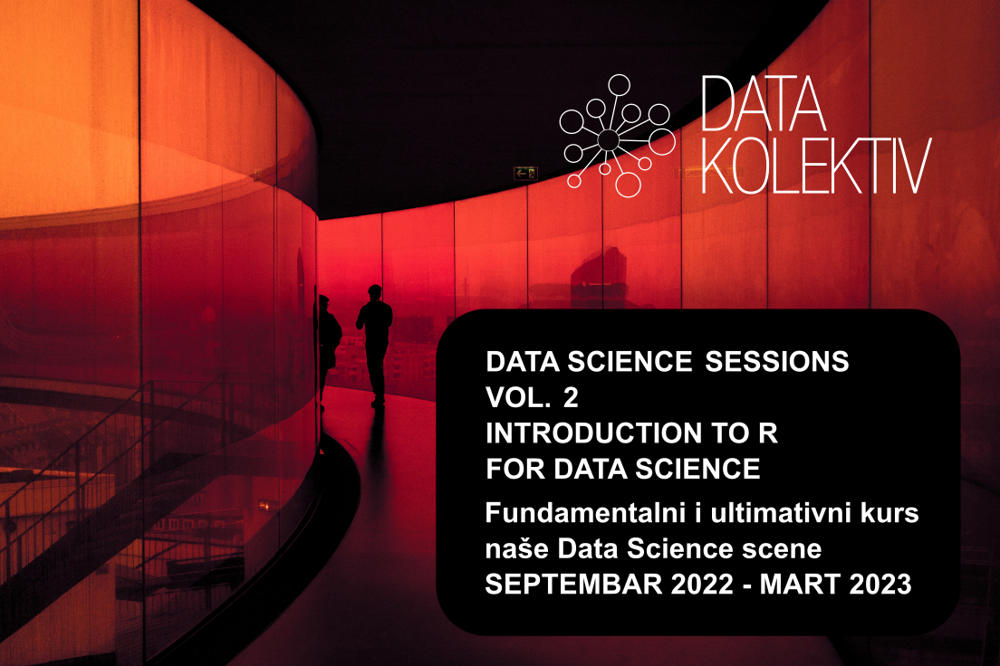

# DATA SCIENCE SESSIONS :: Introduction to R for Data Science
## [Course Website](http://datakolektiv.com/app_direct/introdsnontech/index.html)

## Overview
This course provides a comprehensive introduction to Data Science in the programming language R for those who want to get a grasp on the contemporary approach to analytics, statistics, and machine learning as well as its application - but do not necessarily have a technical background in coding, computer science, or statistics. This is a practical course which provides a minimal but explicable and useful theoretical foundation for those who want to enter Data Science from a (mainly) non-technical perspective and still become able to work efficiently in its highly technical context.

This is planned as you first course in Data Science and it still provides a practical, working knowledge that you can rely on to build research and analytics projects on your own.

Most important of all: you are motivated to learn Data Science in R. If you want it, you want it – and you will work hard to win it. And if you are motivated and prepared to invest hard work, we guarantee success.

We will support you in anything that needs to be done during the course in any of the following operative systems: Windows, Linux Ubuntu/Debian, and macOS. If any of the projects that you would like to develop during the course need rely on heavy computations and/or memory use, we will provide the technical infrastructure to you and teach you how to manage it (up to 128GB of RAM, half TB (that would be 500 GB) of SSD storage, and up to 24 AMD cores for computation).

## GOALS
We want to help you to learn how to learn. The landscape of contemporary Data Science is truly a universe on its own, and no one manages to know it all: it is a world meant for those with curiosity and courage, armed with readiness to explore, learn, unlearn, and relearn. We want to help you to acquire the necessary coding skills together with a practical understanding of the fundamental concepts and principles. Thus only you will be able to put your curiosity to work and start exploring and specializing in Data Science without needing anyone to guide you but yourself. Near the end of this course we expect you to be already able to develop and manage a Data Science project on your own.

## OVERVIEW
We begin with simple guides on how to install the necessary (free and open source) software on your machine. You will be using RStudio, a powerful Integrated Development Environment (IDE) for R, a nice piece of software which will make your work as comfortable and efficient as possible. RStudio is free and easy to install and manage.

Then we will teach you – very patiently – to write computer programs in the programming language R, the lingua franca of the contemporary Data Science, one step at the time. Even the very first programs that you will be writing encompass operations that are highly typical and important in Data Science.

In the following steps, we introduce mathematical concepts of probability, vector and matrix arithmetic, of essential importance in your future work. We provide a highly non-technical, conceptual introduction to the mathematical apparatus, with a plenty of examples for you to study and understand. Each time a new concept is introduced we study and exercise its representation and operation in the programming language R.

We provide an overview of where the data live in this World and how to get to them from R, an overview of all popular data formats and how to work with them, and focus a lot on data wrangling, a process in which Data Scientists clean and reshape their datasets in order to make them suitable for analytics, modeling, and visualization. In a very important chapter we learn how to work with strings and text in R and provide an introduction to regular expressions to process, clean, and correct textual information. We rely on a set of R packages jointly known as tidyverse, of course: it is a powerful standard to manage data in R that Data Scientist are very happy to use.

In the next step you will start producing your first analytics: data overviews, summaries, aggregates, and visualizations. We start introducing the framework of statistical testing and build together your first numerical simulations. The simulations will help you build an essential understanding of probability theory and the behavior of random variables. We will then focus on producing industry standard static visualizations in the R {ggplot2} package, carefully inspecting all important approaches to visual data representation and when to use them.

With the knowledge that you have gathered thus far, you will start building you first models, while being introduced to the essential concepts of learning error, optimization, cross-validation, regularization, and many more. Again, all mathematical concepts are introduced and explained in a highly non-technical manner, and we provide careful guidance while you build your understanding directly by applying each of them. We will go into the details of linear (simple and multiple) and logistic regression (binomial and multinomial) to learn how to deal with simple prediction and classification problems, and then study decision trees and random forests to be able to manage more difficult problems.

Finally, we will help you build your first Data Products, interactive reports with R Markdown that can be served as web-pages to your future clients and collaborators, supported by dynamic, interactive visualizations with Plotly. We will also show how to to build interactive maps and networks and serve them in your nicely designed reports. You will learn how to build a website in R Markdown in simple ways and serve as many reports from there as you need – so that you can start acting like an analytics firm on its own in no time at all.

## COURSE CURRICULUM
The course takes 24 weeks (approximately six months) to complete. We expect you to be able to invest 6 – 8 hours of your time weekly. Each week we will organize a two to three hours lab and meet do learn and discuss new things. Ad hoc 1:1 sessions will be organized. The rest of the expected work is guided exercise, Q&A, labs, and independent project development. All learning material, code and exercises will be provided in a timely manner. If you choose to develop your own Data Science project in this course, support to work with the Git/GitHub version-control system will be provided to you.

**Week 1**

Introduction to the RStudio IDE. First R programs. Installations: R, RStudio, R packages to work with. Learning how to organize your work and stay organized. Hello world. Working with elementary data structures in R.

**Week 2**

Input/Output: Find data, load data, inspect data, and store data in R. Our first visualizations in {ggplot2}. Understanding data management with R and RStudio. Introduction to data formats (CSV and RDS files). What is a data.frame and how do we work with it? Lists, a lot of them. Strings. Notebook

**Week 3**

Introduction to control flow in R (loops, if … else, etc.) + Functional programming in R. More news on strings. 

**Week 4**

Serious programming in R begins: functions, vectorization. More data formats and structures (simple things in JSON and XML). Overview: data types and structures, control flow, functions and functional programming. Why do we have different and rich data structures in R: the philosophy of functional programming. 

**Week 5**

Serious programming in R begins: vector and matrix arithmetic. Elaborated work with strings and text: {stringr} + an introduction to regular expressions (Regex). 

**Week 6**

Introduction to Exploratory Data Analytics: data visualization w. R + {ggplot2} begins. 

**Week 7**

Introduction to Probability Theory in R: building numerical simulations of random variables and visualizing their results. Probability functions. The concept of statistical experiment and numerical simulation. Mean, Variance, and Standard Deviation. The Binomial and the Normal distributions. What are mathematical statistics for? 

**Week 8**

Introduction to Probability Theory in R: probability functions reconsidered. The Poisson distribution. Central Limit Theorem and the Sampling Distribution of a Mean. Serious data wrangling with {tidyr} begins. Understanding the tidy principles of data management. 

**Week 9**

Serious data wrangling with {dplyr} and {tidyr} continues with a lot of exercises. The Relational Data Model. Statistical Hypothesis Testing begins: the Chi-Square distribution and the related statistical test. Can you tell one distribution from another? Examples on real world data. 

**Week 10**

Serious data wrangling with {dplyr} and {tidyr} continues. What Relational Databases (RDBS) are and how do we connect to them? Prerequisites: installing MySQL on your local machine. A crash course in SQL: so similar to {dplyr}. 

**Week 11**

Mastering {data.table}: the essential operations on large datasets. Probability: Conditional Probability. The Bayes’ Theorem. 

**Week 12**

Introduction to Estimation Theory: understanding the logic of statistical modeling. Introduction to covariance, correlation, and Simple Linear Regression. Part and partial correlation. 

**Week 13**

Introduction to Estimation Theory: statistics and parameters. Numerical simulations, visualizations. The logic of statistical modeling elaborated. Enters the Sim-Fit loop. Bias and Variance of a statistical estimate. Parametric bootstrap. 

**Week 14**

Introduction to Estimation Theory. Multiple Linear Regression. Model diganostics. The role of part correlation in this model. Dummy coding of categorical variables in R. 

**Week 15**

Session 15. The logic of statistical modeling explained: optimize the Simple Linear Regression model from scratch. Understanding why statistics = learning: the concept of error minimization. 

**Week 16**

Session 16. Generalized Linear Models I. Binary classification problems: enters Binomial Logistic Regression. Probability Theory: a Maximum Likelihood Estimate (MLE). 

**Week 17**

Generalized Linear Models II.Multinomial Logistic Regression for classification problems. ROC analysis for classification problems. Maximum Likelihood Estimation (MLE) revisited. 

**Week 18**

Generalized Linear Models III. Poisson regression. Negative binomial regression. Cross-validation in Regression problems. 

**Week 19**

Cross-validation in classification problems. An introduction to Decision Trees: complicated classification problems and powerful solutions. Postpruning of a Decision Tree model. 

**Week 20**

Classification and Regression Tress (CART) w. {rpart}. Elements of Information Theory for Classification Trees. Pre-pruning and post-pruning (revisited) of Decision Trees. 

**Week 21**

Random Forests: Bagging, Out-Of-Bag (OOB) Error, Bootstrap Samples + Random Subspace Method. 

**Week 22**

Regularization (L1 and L2) in regression problems. The Bias-Variance Problem. Running R code in parallel to speed up data processing and modeling. 

**Final Workshop (Week 23/24)**

**Week 23**

Reporting in R Markdown. Interactive visualizations with Plotly, visNetwork, and Leaflet maps. Random Forest and GLMs in action: Case Study A.

**Week 24**

Building a simple analytics website with R Markdown. Random Forest and GLMs in action: Case study B.
