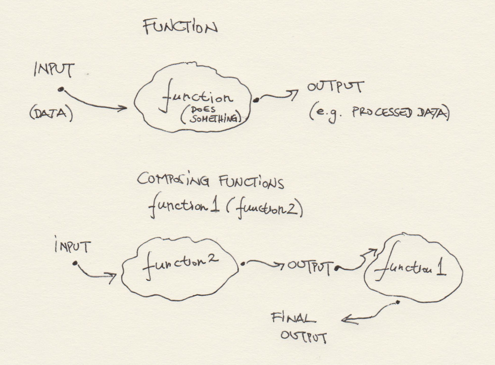
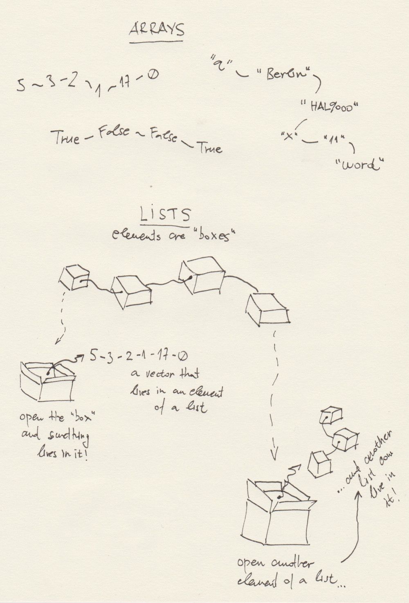

***
# Session 01: Feeling R: Basics + Intuitive Understanding of R 
**Feedback** should be send to `goran.milovanovic@datakolektiv.com`. 
These notebooks accompany the Intro to Data Science: Non-Technical Background course 2020/21.

***

### Welcome to R!


### What do we want to do today?

Our goal in `Session 01` is to develop and intuition of R, and *a feeling for* the programming language R. Yes, we need to work on our emotions, dear students. Because programming in Data Science - as well as programming in general - is nothing but communication, and a very specific one. Programming languages are not very tolerant in the way they communicate with us: for example, they demand that we be very upfront and straightforward, and they have no tolerance for ambiguity. If they do not understand something that we say, they will immediately respond with a cold - and at first cryptic - error message. That means that we need to be very patient while we learn the strict rules of communication with machines in Data Science and elsewhere. I guarantee you that there is a specific emotional state, a specific state of mind, that accompanies the focused work of any programmer and Data Scientist. It is a kind of calmness coupled with a good, very good intuition about the nature of the programming language they use. This is our goal: we need to start developing our intuition about R. How does R like to work?

### 0. Prerequisits.

None. There is an R console open in front of your eyes and you can reach your machine's keyboard.

### 1. Navigating the work environment: where am I?

Everything happens in folders (or directories - simply pick the term of your preference), right? Say, we want to write our first R program - a *script*, as it is usually called. That program will consist of a set of lines in the programming language R, and those lines will be telling to our machine what to we want from her. Ok, this set of lines - a script - needs to live somewhere. It needs to live in some directory on your computer's disk. 

When we work in R, there is always something called a **working directory**. There is a *function* in R - think of it as a free R program that you already have upon installing this programming language - that will let you know what is your current working directory. If you write any R code and decide to save it for later use, and do not specify the directory where you want it to live, R will use your current working directory as a destination folder. That function is `get_wd()`

```{r echo = T}
getwd()
```

**Note.** As you can see, the file paths in R are a bit different that those that you are used to see on the Windows operative system (but exactly the same as those we have on Linux). R will use `/` to define paths, while Windows uses the backslash - `\` - instead. Your RStudio IDE takes care that these paths are compatible so there is nothing you need to worry about (for now).

The output of `getwd()` should end with `01_IntroDataScience_Non-Tech/_Code` if you have opened the course RStudio project exactly as suggested in the beginning of this session. What comes before `01_IntroDataScience_Non-Tech/_Code` is the path on your local filesystem (i.e. your machine) where you have cloned the course repository.

Now, let's learn about the contents of our current working directory:

``` {r echo = T}
list.files(getwd())
```

Take a look at `list.files(getwd())` carefully. We have already learned that `getwd()` is an R function. That function takes **no input**, and returns one **output**: the path towards the current working directory. Now, `list.files(getwd())` *composes* two R functions: `getwd()` is the first one, and `list.files()` is the second one. The later takes **one input** - that being the results of `getwd()` - and returns **one output**, namely the list of files found in the directory on the path returned by a previous `getwd()` call. In programming, R represents and instance of something called a **functional programming language**. Right now, this means very little to you, so we can simply say just the following: you will be using a tons of functions in R and combine them in crazy ways. And that is why it is important to develop an intuition about functions since the very beginning.

**WARNING.** I can code, but I cannot draw. This is how I envision functions and their composition:



Ok, `list.files(getwd())` returned a list of *files* found under our working directory that we have in turn obtained from `getwd()`. There is more: we know that the current working directory is 

``` {r echo = T}
getwd()
```

and now we ask: what is found in `C:/Users/goran/___DataKolektiv/__EDU/01_IntroDataScience_Non-Tech/_Code/`, the directory right above our current working directory where we find the `.Rmd` R Notebook file (the one that we are now using)?

``` {r echo = T}
# THIS IS A COMMENT: This chunk of code makes use of the `list.files()` R function
list.files('C:/Users/goran/___DataKolektiv/__EDU/01_IntroDataScience_Non-Tech/_Code/')
```

Ok, we find one file (e.g. `_Code.Rproj`) and many directories (`img`, `IntroDataScience_NonTech_S00`, `IntroDataScience_NonTech_S01`, etc.). Now, imagine I want to work in `C:/Users/goran/___DataKolektiv/__EDU/01_IntroDataScience_Non-Tech/_Code/` instead of working in:

``` {r echo = T}
getwd()
```

How does one change a working directory in R? We have a function (of course) to do that:

``` {r echo = T}
setwd('C:/Users/goran/___DataKolektiv/__EDU/01_IntroDataScience_Non-Tech/_Code/')
```

Now, we need to be very careful because we are working from R Markdown: type `getwd()` in the console and take a look at its output. Now execute the following chunk of R code here:

``` {r echo = T}
getwd()
```
So, nothing changed. The moral of the story: changing a directory *inside an R Markdown code chunk* will change the working directory only until the code in the chunk executes, but it will not change the working directory for any subsequent chunks. If we did this in a console, or in an R script - and both are different from executing the code from an R Markdown Notebook - once called, `setwd()` would change the working directory until something else changes it again. That is why R Markdown complained after out `setwd()` call.


### 2. Functions? Variables? Hello, World.

Let's learn something about the in-built functions R. Those are the R functions - again, think of them simply as pieces of R code that does something - that are placed under your availability as soon as you have installed R. Also, we need to start learning about *variables* and their corresponding *types* in R.

You know the famous `Hello, World.` message in programming? Typically an exemplar of someone's first code in a newly discovered programming language... Let's try:

``` {r echo = T, eval = F}
Hello, World.
```

Well, that didn't work. How about:

``` {r echo = T}
print('Hello, World.')
```

And here it is. Ok, `'Hello, World.'`, and what about: `"Hello, World."`? (Mind the difference, please)

``` {r echo = T}
print("Hello, World.")
```

So, *strings* in R (technically called: `characters`) can be encompassed by `'` or `"` whatsoever: it's the same. However, It is a good manner of coding practice to choose which one will you use and be consistent in that decision. **Note:** use `"` wherever possible.

Wait, `'Hello, World.'` are two words, right:

``` {r echo = T}
word1 <- "Hello"
word2 <- "World"
print(word1)
print(word2)
```
Ok, that is not what we wanted, but let's learn a few things. We have instantiated one variable in R, `word1`, and then another one, `word2`. By using the R *assignment operator* - `<-` - we have assigned the character value of `"Hello"` to `word1` and the value of `"World"` to `word2`. Then we have called the function `print()` twice to print out the values of the two variables.

**NOTE.** You can use `=` as an assingment operator in R, of course, try: `word = "Hello"`, for example. However, **we do not do it by convention in R: we prefer to use the `<-` assingment operator**. Use `=` instead and you will easily confuse any mature R programmer that you eventually need to work with. Don't do it.

Let's get closer to the result that we were looking for:

``` {r echo = T}
word1 <- "Hello"
word2 <- "World"
paste(word1, word2, sep = ", ")
```

Close. We need an `.` at the end, so let's try:

``` {r echo = T}
word1 <- "Hello"
word2 <- "World"
paste(word1, word2, ".", sep = ", ")
```

and that is not it, right? Right. We need to start learning something about the logic of R functions like `paste()` that puts strings together, obviously. First question, how many *arguments* did we pass to `paste()` in `paste(word1, word2, ".", sep = ", ")`?

Answer: four (4) arguments. Let's see: `word1` is the first, `word2` the second, now, full stop, `.`, is the third, and finally the value for the separator, `sep` which we have set to `", "`, is the fourth. `paste()` functions by putting together all its first, string arguments, separating them by the value of the `sep` argument. But we didn't need a full stop placed between `word1` and `word2`! What we do? 

We call `paste()` twice:

``` {r echo = T}
word1 <- "Hello"
word2 <- "World"
paste(
  paste(word1, word2, sep = ", "),
  "."
)
```

Almost. What we do not like is the empty space between the end of `word2` and `.`:

``` {r echo = T}
word1 <- "Hello"
word2 <- "World"
paste(
  paste(word1, word2, sep = ", "),
  ".", 
  sep = ""
)
```

What have we learned: that the `sep` argument of `paste` has a *default* value of `" "` - an empty space. Only when we have explicitly instructed `paste()` to use `sep = ""` - an empty string - the results was what we have looked for. As I told you: programming languages are very strict when it comes to communication, they have their inner rules and logic, and one needs to learn and understand that logic completely (or almost completely) to be in full command of a programming language. Also, we have learned that some arguments in some R functions have *default values*: if we do not specify a value of the argument that we want to use, the function will use its default value. 

### 2. Lists, arrays, and a bit more complicated functions.


What R functions have we seen thus far? Let's see: `print()`, `paste()`, `list.files()`, `getwd()`, `setwd()`. There are tons of them, I assure you. Take a look at this one, for example:

``` {r echo = T}
word <- 'Hello World'
strsplit(word, split = " ")
```
Ok, the meaning of `strsplit()` is, obviously `string split`, and it somehow breaks the strings in pieces, obviously using the `split` argument to learn what separator do we want to use to decompose a string, but... But the output looks strange, doesn't it?

What is `[[1]]`, and why does the result follows only after it and an additional `[1]`? This is so because `strsplit()` returns a **list**, which is a very important data type in R. Things in R - call them variables - have a data type associated. A thing can be an integer, or a real number, or perhaps a string (again, that data type is called `character` in R)... But they can also be a bit more complicated, like *arrays* and *lists*. Now, let's start with lists, very important in R. What is a list?

``` {r echo = T}
word <- 'Hello World'
s <- strsplit(word, split = " ")
class(s)
```
Yes, I have assigned the output of `strsplit(word, split = " ")` to `s`, and then used the `class()` function to ask for a data type of `s` - and it is a list indeed. Let's `print(s)`:

``` {r echo = T}
print(s)
```

Again! But, what if ...

``` {r echo = T}
print(s[[1]])
```

Interesting. Here is what is happening:

- `s` is a list of length one, which means that it has only one element;
- that first element of `s` is found by using the [[1]] index; for lists, the index is always placed in **double square brackets**: `[[` and `]]`, like in: `s[[1]]`;
- then there is the `[1] "Hello" "World"` and that is an **array** - which we can also call a **vector** - of length two (because it has two elements, `Hello` and `World`), and `[1]` is simply the index of the first element of that array.

This can all sound really complicated at this point, but it is really not. Let's now start moving one step at the time.

``` {r echo = T}
mySequence <- 1:100
print(mySequence)
```

Demystifying the `[1]` part of the `strsplit()` output - the one for which I've explained that is the index of the first element in the array composed of two following elements: `"Hello"` and "`World`":

- by `mySequence <- 1:100` I have created an array, a sequence of numbers from 1 to 100, using the `:` operator in R; by assignment `<-` that sequence becomes the value of the variable `mySequence`;
- the `print(mySequence)` line is self-explanatory, and
- from the output we can see that the indices found under square brackets (single! - they are array indices, not list indices) are simply the ordinal numbers of the first element of the `mySequence` array in each row of the ouput - nothing more than that. 

That is exactly what happend in the `[1] "Hello" "World"` part of the output. Now, about those double square brackets, `[[` and `]]` that are used in lists; take a look at this:

``` {r echo = T}
myList <- list()
myList[[1]] <- 1:10
myList[[2]] <- 11:20
myList
```

Does it make more sense now? The `myList` list encompasses two arrays, and those two arrays have indices `[[1]]` and `[[2]]`, of course. So we use `[[` and `]]` to index lists in R, and `[` and `]` to index arrays. To illustrate, again, with more numbers:

``` {r echo = T}
myList <- list()
myList[[1]] <- 1:100
myList[[2]] <- 101:200
myList
```

Do you now understand how list and array indices are used in the R output?

**WARNING.** My drawing, again: this is how I envision the difference between lists and arrays in R.



Let me try to explain:

- arrays encompass only elements of the same data type: numbers, characters, logicals, etc.;
- I envision arrays as elements that are directly related to each other, "chained" to follow one another;
- lists, on the other hand, I envision as a chain of boxes, and each box can contain anything irrespective of what is found in other boxes;
- I need to unpack a box - i.e. access an element of list by `[[` and `]]` - to find out what is in a box, and I can find various arrays living there;
- Also, something that we will begin to study very soon: a box can live inside a box. In other words: a list can be an element of another list. We call them *nested lists* in R.

I have used a previously unused function in this Notebook: `list()`. There are R functions that are meant to create variables of a certain data type, and `list()` is one of them:

``` {r echo = T}
a <- list()
a
```

What is `a`?

``` {r echo = T}
class(a)
```

Of course. What else can I create?

``` {r echo = T}
a <- numeric()
a
```
Ok, it is a `numeric` type of length(0). Now:

``` {r echo = T}
a <- numeric(5)
a
```

Now this is an *array*, or a *vector* if you like (a and one-dimensional vector, to be precise), of length 5: it has five elements, all `0` valued as per default.

Wait:

``` {r echo = T}
a <- character(5)
a
```
Ok, the empty string `""` is the default for creating character arrays with `character()`. I've been mentioning the word `length` for a while. Look:

``` {r echo= T}
a <- c(1, 2, 3)
length(a)
```
Now we understand the R function `length()`: tell me how many elements there are in an array.
**NOTE.** The `c()` function, of the most commonly used things in R, puts thing together in an array. Nothing else. 

But **why** do we have lists and arrays: both seem to be collections of things that are indexed? Here is the fundamental difference:

- *arrays* can contain data that all must be of the **same** type, while
- *lists* can put up together just **anything**.

The serious game of R data types begins now. 

### 3. Elementary truths about data types in R

Look:

``` {r echo = T}
myArray1 <- c(1,2,3,4)
myArray2 <- c(1,"2",3,4)
print(myArray1)
print(myArray2)
```

What? What has just happened? Well, to understand what happened, you need to keep in your mind the fact that R arrays can encompass only elements of the same data type. The first one - `myArray1` - is not problematic: it encompasses only things of `integer` (or `numeric` in R, as you will see) type. But the second one, `myArray2` is strange: we produced it by combining three numbers (`1`, `2`, and `3`), and one *character* type (`"2"`; never forget, writing out a number to a computer, like `2`, means you want to use a number, while writing out something quoted, like `"2"` means you want to use a character, a string, a text - and that is not the same). What did R do? As we can see from the output: `[1] "1" "2" "3" "4"` - R has **converted** everything to a `character` type. So, two things to remember: (1) R automatically does type conversion, so for example when it sees you trying to put together numbers and characters, it will default to convert everything to characters, and (2) some data types are "older" than the others, for example `character` is obviously "older" than `numeric` since R did not try to convert `"2"` to a number (as you might have expected) but in turn decided to convert `1`, `2`, and `3` to characters. You will get use to this, don't worry.

But what if we wanted R to understand that by `myArray2 <- c(1,"2",3,4)` we mean numbers? Then:

``` {r echo = T}
myArray2 <- as.numeric(c(1,"2",3,4))
print(myArray2)
```

So, if we want to override R's **implicit**, **automatic** type conversion, which implies that numbers will be automatically converted to characters and not vice versa, we need to instruct R that we want an **explicit** type conversion by using the appropriate function, `as.numeric()` in this case.

For example:

``` {r echo = T}
logic <- c(0,1,1,0)
as.logical(logic)
```

What have we learned: there is a data type called `logical` in R (also known as *Boolean*), and it can take only two values: `TRUE` and `FALSE` (**note:** always capitalized in R). So, `1` is always `TRUE`, while `0` is always `FALSE`, right? No:

``` {r echo = T}
logic <- c(0,3,1,0)
as.logical(logic)
```
When converting numbers to logicals in R, `0` is always `FALSE`. Try `as.logical(-4)`, or `as.logical(3.14)` to make sure.

Now, what if we want to maintain a collection of data of various types? Then lists come into play:

``` {r echo = T}
myList <- list(1, 2, "3", 4)
print(myList)
```
Now:

- the list has four elements: `[[1]]`, `[[2]]`, `[[3]]`, and `[[4]]`;
- each element contains an array of length one: `1`, `2`, `"3"`, and `4`, and
- their data types are:

``` {r echo = T}
class(myList)
```

Oh, no, `class()` returned the data type of the whole list! R has functions - a very important and powerful set of functions indeed - to work with lists. Look:

``` {r echo = T}
lapply(myList, class)
```

`lapply()` is an R function that (1) for a given function as its second argument (`class()` in this example) (2) returns a result of that function's call, taking each element of its first argument - which is a list, `myList` in our example - as the respective function's input, and (3) returns a result as a list of the length equal to the length of the input list. 

Let's experiment to understand `lapply()`, a function of extreme importance in R programming, better:

``` {r echo = T}
myList <- list(1, 2, "3", 4)
lapply(myList, as.numeric)
```

So, `lapply()` called `as.numeric()` on each element in `myList` and returned a converted value. Again:

``` {r echo = T}
myList <- list(1, 2, "3", 4)
lapply(myList, as.character)
```

And again for `as.logical`:

``` {r echo = T}
myList <- list(1, 2, "3", 4)
lapply(myList, as.logical)
```

Wait, what is the `NA` value in `[[3]]`? The third element of the `myList` list is a character, `"3"`. We asked `lapply()` to apply `as.logical()` to all members of `myList`. It did well for the numbers (all positive, so all `TRUE`), but it failed for `"3"` which is a character - and R does not know how to treat a character value under `as.logical` - should it be `TRUE` or `FALSE`. Since a conversion of that kind is not defined in R, it returned `NA`, short for `Not Available`. You will see `NA` used a lot in Data Science in R, anytime the value is, for some reason, *missing*.

### 4. Our own R functions 

Remember how it started: I've told you that you should think of R functions simply as collections of R code that does something for us. For example, repetitive things: there is something that can be done with data, but the data can vary while what can be done to it remains the same - and then we need a function. It is a piece of code that always does one and the same thing over it *inputs*: the things that we pass to it. Say, we pass `3` and `4` to some R function called `muFun()` and we want to it to return the result of `3+4`, but we do not want to change it just to be able to do the same for `1` and `2`, or `1000` and `3.14`.

We have seen that R has many in-built functions. When we start adding R packages to our work in the next session you will see that it actually has an unknown, very, very large number of them. But can we define our own functions in R? Of course. It is simple:

``` {r echo = T}
myFun <- function(a, b) {
  summa <- a + b
  return(summa)
}
```

Nothing happens? We need to **call** a function from R in order to make it work. Look:

``` {r echo = T}
myFun(5, 6)
```

Let us analyze the function code, line by line:

- `myFun <- function(a, b)` is the very function definition: it tells R that we want to define a function that takes two input arguments, `a` and `b`;
- `{` that follows is it signifies the begging of a **code block** - a collection of R instructions, new function calls, operations, iterations, etc. that process the function's arguments `a` and `b` in some way;
- `summa <- a + b`: we instantiate a new variable called `summa` in the function `myFun` and assign it the value of the expression `a + b`;
- `return(summa)` tells the function to stop its execution and sends back the argument of the function `return()` to the caller - the R expression that has made the call to `myFun`; and finally, 
- `}` closes the code block previously opened with `{`.

What happens when we do:

``` {r echo = T}
myResult <- myFun(2.5, 2.6)
print(myResult)
```

is the following flow of events:

- the value of `2.5` binds to the function's `a` argument;
- the value of `2.6` binds to the function's `b` argument;
- `a + b` is executed inside the function and assigned to `summa`;
- `summa` is returned to the caller `myResult <- myFun(2.5,2.6)` where the output of `myFun` - and that is what `return(summa)` defines - binds to myResult;
- `myResult` is printed by `print()` outside the function.

Remember `lapply()`? Let's play a bit:

``` {r echo = T}
myList <- list(
  'New York, USA',
  'Belgrade, Serbia',
  'Moscow, Russia',
  'Berlin, Germany',
  'London, UK',
  'Paris, France',
  'Rome, Italy'
)
print(myList)
```

Ok, we have a list. I want to write out a function that will return separately the city and the country in which it resides from `myList`. Here is a way to do it with our mighty friend, `lapply()`:

``` {r echo = T}
lapply(myList, strsplit, split = ", ")
```

Oh, only that the output looks even more complicated now, what is this:

```
[[7]]
[[7]][[1]]
[1] "Rome"  "Italy"
```

I know that this now really feels uncomfortable, but I promise you that it is not that difficult at all.

It reads in R in the following way: it is the seventh (`[[7]]`) element of the output from `lapply`, and that seventh element contains one list (`[[7]][[1]]`), and than that list contains an array with the following elements: `"Rome"`, and  `"Italy".

Why so complicated? Because of what we have already learned: `lapply()` returns a list, but `strsplit()` *also* returns a list, so the result is, naturally, a *list of lists*. 

**NOTE.** You will need to manage such complicated, nested data structures in R a lot if you are about to enter Data Science. Don't be scared: it is only practice that you are missing at this point.

Take a careful look to our call to `lapply()` again:

``` {r echo = T, execute = F}
lapply(myList, strsplit, split = ", ")
```


We have asked R to `lapply()` the function `strsplit` to `myList`, and in the end passed the argument `split` which is actually an argument meant for `strsplit()`, not `lapply()`. This is very handy when you need to `lapply()` other functions, but with a specific value for some argument that they might use. 

Let's now try to simplify the result of this operation a bit:

``` {r echo = T}
separateCities <- function(string) {
  return(
    strsplit(string, split = ", ")[[1]]
  )
}
lapply(myList, separateCities)
```

Now that is similar to what we have seen from `lapply()` before. How did we achieve this? Let' analyze our `separateCities()` function:

```
separateCities <- function(string) {
  return(
    strsplit(string, split = ", ")[[1]]
  )
}
```

In this case, there is no separate "process" and "return output" step: I have nested the processing of the function's `string` input in the `return()` call by doing: `return(strsplit(string, split = ", ")[[1]])`. I simply found it to be more convenient; for a function with a more complicated code, I would probably avoid doing something likes this. Now, let's take a look at the `strsplit(string, split = ", ")[[1]]` part: what it does is that it calls `strsplit()`, passing `string` as an input, and defining the value of the `split` argument to be `", "`, but I have also added something: `[[1]]` at the end of the call to `strsplit()`. Why? Because I know that `strsplit()` returns a list that will encompass an array with the results that I expect, so that by saying to R something like `return(strsplit(x, split = ", ")[[1]])` I am asking for what is **inside** the list returned by `strsplit`, and not the direct result of `strsplit(x, split = ", ")`. And what is inside that list is an array. If you still ask yourself where did the output list came from in our `lapply()` call: don't forget that `lapply()` returns a list by itself. 

Three things and tricks to remember:

- 1. `lapply()` returns a list; `strsplit()` returns a list; and many other R functions as well; if you compose a call to one with a call to another, don't expect to get anything else back but a list of lists;

- 2. the output of `lapply()` can be simplified by a call to its sister function called `sapply()`, like this:

``` {r echo = T}
separateCities <- function(string) {
  return(
    strsplit(string, split = ", ")[[1]]
  )
}
sapply(myList, separateCities)
```

Now, this looks better *somehow* (it's a sort of a tabular structure, the cities are in the first row, the countries in the second row) but we still do not get to understand exactly how `sapply()` achieved this. More on data structures like this one will be presented and discussed in our next sessions, especially when we start talking about vectors, matrices, and code vectorization in R.

- 3. Finally, if you want to strip the list of the result of a function that returns a list by its definition, simply pick it up by `[[` and `]]`, as we did in our `strsplit()` call: `strsplit(string, split = ", ")[[1]]`.

To end this session with an understanding of nested lists in R, because I can imagine many will be confused by that:

``` {r echo = T}
a <- list()
a[[1]] <- 5
a[[2]] <- 7
print(a)
```
Ok, let' say this is a *simple list*: it has two elements, each element has one numeric in it. Now:

``` {r echo = T}
a <- list()
a[[1]] <- list(5, 7)
a[[2]] <- list(1, 3)
print(a)
```

Let's read it out:

- `a` has two elements, indexed as `[[1]]` (the first one) and `[[2]]` (the second one);
- the first element of `a`, which we refer to in R as `a[[1]]`, is a list itself, and has two elements, against referenced as `[[1]]` and `[[2]]`, the first containing a numeric `5` and the second containing a numeric `7`;
- the two lists nested in `a[[1]]` can be acessed by `a[[1]][[1]]` and `a[[1]][[2]]` respectively:

``` {r echo = T}
a[[1]]
```

``` {r echo = T}
a[[1]][[1]]
```
``` {r echo = T}
a[[1]][[2]]
```

and the same can be done for `a[[2]]`:

``` {r echo = T}
a[[2]][[1]]
```

``` {r echo = T}
a[[2]][[2]]
```

Nested lists are not complicated at all, it is just a matter of getting used to the way the R syntax is used to access their elements. 

For arrays, we only use `[` and `]` to access their elements:

``` {r echo = T}
a <- 1:100
a[50]
```

And, **very important**, we can slice out elements of arrays:

``` {r echo = T}
a[25:50]
```
Once again, to access an element of a list, use `[[` and `]]`:

``` {r echo = T}
a <- list(1,2,3,4,5)
a[[4]]
```

But to slice out a part of the list - a range of its elements, **do not use** `[[` and `]]`, but only `[` and `]`:

``` {r echo = T}
a <- list(1,2,3,4,5)
a[3:4]
```

Finally, you will love the fact that things like `lapply()` can be used on vectors too:

``` {r echo = T}
a <- c(1,2,3,4)
lapply(a, "^", 2)
```

Did you like it? Here is what I did:

- there is an array `a`,
- then a `lapply()` call to call the function "^" (other languages would call "^" an operator - some reasons why I simply adore R and its functional nature) and pass it a second parameter `2`. 

The results is a list of elements in `a` all raised on power of `2`. 

``` {r echo = T}
a[[3]]
a[[3]]^2
```

Enjoy this:

``` {r echo = T}
5^2 
```
``` {r echo = T}
"^"(5, 2) 
```

### 5. `data.frame`

Lists are not the only beings in R that can hold together things of different types.

Introducing `data.frame`, the data type that makes Data Science possible:

``` {r echo = T}
# - Comment: the population data represent the most recently updated figures
# - from Wikidata: https://www.wikidata.org/

# - let's produce several vectors:
cities <- c('New York', 'Belgrade', 'Moscow', 'Paris', 'Rome', 'Berlin')
countries <- c('USA', 'Serbia', 'Russia', 'France', 'Italy', 'Germany')
populations <- c(8405837,  1378682, 12692466, 2187526, 2872800, 3644826)
lattitudes <- c(40.730610,  44.787197, 55.751244, 48.864716,  41.902782, 52.520008)
longitudes <- c(-73.935242, 20.457273, 37.618423, 2.349014, 12.496366, 13.404954)

# - now let's have a data.frame:
myCities <- data.frame(city = cities,
                       country = countries, 
                       population = populations, 
                       lat = lattitudes, 
                       lon = longitudes, 
                       stringsAsFactors = FALSE)

# - display myCities:
print(myCities)
```

How do we access different columns in a `data.frame`? Easy:

``` {r echo = T}
myCities$city
```

``` {r echo = T}
myCities$population
```

``` {r echo = T}
print(myCities[ , c('lat', 'lon')])
```

**NOTE.** Mind the usage of `[ ,` in the previous **subsetting** of the `myCities` `data.frame`: what if I asked for `myCities[1, c('lat', 'lon')]` only:

``` {r echo = T}
myCities[1, c('lat', 'lon')]
```

And what if asked for:

``` {r echo = T}
myCities[1:2, c('lat', 'lon')]
```

But when I say `[ , c('lat', 'lon')]`, that means that I want **all** the rows, and only the `c('lat', 'lon')` columns:

``` {r echo = T}
myCities[ , c('lat', 'lon')]
```

We will be learning **a lot** about `data.frames` in our future sessions. 

### 6. The shape of things to come: beauty and simplicity

#### 6.A Example: Interactive geo-visualization in 9 lines of code

Now, allow me to show you how powerful R really is. How many lines of R code do I need to create an interactive map that singles out cities found in the `myCities` `data.frame` by markers that display information on them when clicked upon? Let's see:

``` {r echo = T,  message = F, warning = F}
# - Setup
# - Install {leaflet} if not installed;
# - install.packages('leaflet')
# - {dplyr} should be present already

# - load R packages
library(leaflet)
library(dplyr)
# - Execute
leaflet(width = "100%") %>%
  addTiles() %>%
  addMarkers(data = myCities,
             popup = (paste0('<b>City: ', myCities$city, '</b><br>',
                            '<b>Country: ', myCities$country, '</b><br>',
                            '<b>Population: ', myCities$population, '</b>'))
  )
```

That would be nine (9) lines of code, not counting the comments of course. 

#### 6.B Example: Rapid visualizations w. {ggplot2}

A famous dataset used in Data Science trainings, `mtcars`, enters, together with the industrial standard visualization library `{ggplot2}`:

``` {r echo = T, message = F, warning = F}
# - install {ggplot2} if not installed
# - install.packages('ggplot2')
# - install {ggrepel} if not installed
# - install.packages('ggrepel')
library(ggplot2)
library(ggrepel)
data(mtcars)
mtcars$model <- row.names(mtcars)
mtcars$gear <- as.factor(mtcars$gear)
print(mtcars)
```

``` {r echo = T}
ggplot(data = mtcars, 
       aes(x = mpg, y = qsec,
           label = model, 
           group = gear, 
           color = gear)) + 
  geom_point() + 
  scale_color_discrete() + 
  geom_smooth(method = "lm", 
              size = .15) + 
  geom_text_repel(size = 3) + 
  ggtitle("mpg vs. qsec in the mtcars dataset, per gear.") + 
  theme_bw() + 
  theme(plot.title = element_text(size = 10)) + 
  theme(panel.border = element_blank())
```

But if you want to be sure that you can use this power in a responsible way, you need to get along with vectors, lists, nested lists, functions, code vectorization, and many other things as well.

Stay tuned. We didn't even start the dance yet.

### Further Readings

- [Chapter 1 Starting out in R from Introduction to R, version](https://monashdatafluency.github.io/r-intro-2/starting-out-in-r.html#saving-code-in-an-r-script)
- [Chapter Data Types and Structures from Programming with R](https://swcarpentry.github.io/r-novice-inflammation/13-supp-data-structures/)
- [Chapter 4 Workflow: basics from R for Data Science](https://r4ds.had.co.nz/workflow-basics.html)

### Highly Recommended To Do

- Read [Chapters 1 to 3 from R for Data Science, Hadley Wickham & Garrett Grolemund](https://r4ds.had.co.nz/)
- Read [Chapters 1 to 5 from Norman Matloff’s The Art of R Programming](https://www.google.com/search?client=firefox-b-d&channel=trow2&sxsrf=ALeKk03T_qLCMzRICYWj5UHqFBHnvfV6Uw%3A1607220795553&ei=Oz7MX8aeIYK6kwWc5JbgAw&q=Norman+Matloff+The+Art+of+R+Programming+pdf&oq=Norman+Matloff+The+Art+of+R+Programming+pdf&gs_lcp=CgZwc3ktYWIQAzIFCAAQyQM6BwgjEMkDECc6AgguUJk9WOdAYKRBaABwAHgAgAGHAYgB9QOSAQMwLjSYAQCgAQGqAQdnd3Mtd2l6wAEB&sclient=psy-ab&ved=0ahUKEwiGqOCEpLjtAhUC3aQKHRyyBTwQ4dUDCAw&uact=5)

### R Markdown

[R Markdown](https://rmarkdown.rstudio.com/) is what I have used to produce this beautiful Notebook. We will learn more about it near the end of the course, but if you already feel ready to dive deep, here's a book: [R Markdown: The Definitive Guide, Yihui Xie, J. J. Allaire, Garrett Grolemunds.](https://bookdown.org/yihui/rmarkdown/) 


***
Goran S. Milovanović

DataKolektiv, 2020/21

contact: goran.milovanovic@datakolektiv.com


***
License: [GPLv3](http://www.gnu.org/licenses/gpl-3.0.txt)
This Notebook is free software: you can redistribute it and/or modify it under the terms of the GNU General Public License as published by the Free Software Foundation, either version 3 of the License, or (at your option) any later version.
This Notebook is distributed in the hope that it will be useful, but WITHOUT ANY WARRANTY; without even the implied warranty of MERCHANTABILITY or FITNESS FOR A PARTICULAR PURPOSE.  See the GNU General Public License for more details.
You should have received a copy of the GNU General Public License along with this Notebook. If not, see <http://www.gnu.org/licenses/>.

***

