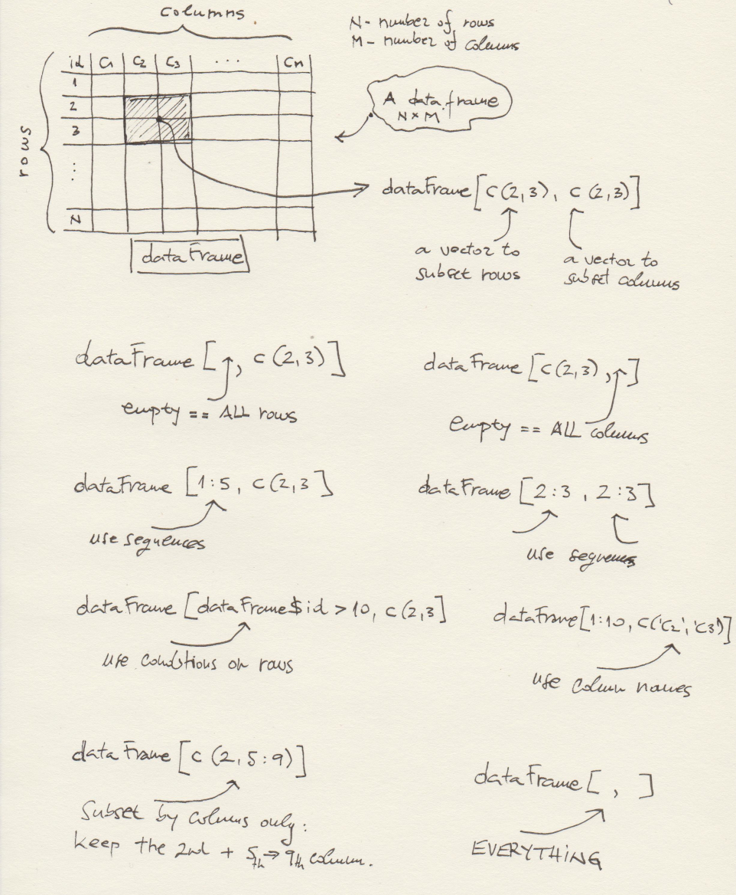

***
# Session 02: Installing R packages, I/O + a deep dive into the `data.frame` class 
**Feedback** should be send to `goran.milovanovic@datakolektiv.com`. 
These notebooks accompany the Intro to Data Science: Non-Technical Background course 2020/21.

***

### What do we want to do today?

Data Science is, well, all about data. But data lives somewhere. Where? How do we find them? In this session we will learn about the basic I/O (Input/Output) operations in R: how to load the disk stored data written in various formats in R, and how to store them back. We will learn that sometimes it makes no difference if the dataset lives on the Internet or on our local hard drives. We will learn to perform the basic I/O operations in base R before we start meeting the friendly [tidyverse](https://www.tidyverse.org/) packages - [readr](https://readr.tidyverse.org/), for example - that provide improved and somewhat more comfortable to work with procedures.
We will learn more about the `data.frame` in R: what is subsetting and is it done, how to summarize a dataset represented by a `data.frame` in R, how to bind dataframes together. We continue to play with lists too and start learning about simple operations on strings in base R. 


### 0. Prerequisits.

- Create a directory named `_data` in the directory where you want to store your R code for this session. 
- Go to the [Inside Airbnb](http://insideairbnb.com/get-the-data.html) page and download the [`listings.csv`](http://data.insideairbnb.com/the-netherlands/north-holland/amsterdam/2020-12-12/visualisations/listings.csv) `csv` file (under the *Amsterdam, North Holland, The Netherlands* section). Let's learn something right now: `.csv` is short for **comma separated values** and represents one the most frequently observed file formats used in practice. The entries in this file are separated by commas: hence the name. The `csv` format has many close relatives, of which `tsv` - **tab separated values** - is probably the most famous one. 
- Open the `listings.csv` file in Microsoft Excel or Libre Calc and save it using the same filename but as an `.xlsx` file in your `_data` directory.


### 1. Read data + inspect a data frame + store data

Again, everything happens in a directory somewhere. You really need to keep the organization of your directories neat!

Remember, when we work in R, there is always something called a **working directory**. I know you have opened and R session in RStudio: ask yourself "Where am I?":

``` {r echo = T}
getwd()
```

``` {r echo = T}
list.dirs(getwd())
```

Ok, so I do have a `_data` directory in my working directory. Let's pronounce the `_data` directory in R:

``` {r echo = T}
dataDir <- paste0(getwd(), '/_data/')
list.files(dataDir)
```
^^ And here is the `listings.csv` file. It represents the Airbnb summary information and metrics for listings in Amsterdam. We will use it to practice our data frame skills in R.

We want to read `listings.csv` to R and make it a `data.frame`. This is how we do it:

```{r echo = T}
filename <- paste0(dataDir, 'listings.csv')
listings <- read.csv(file = filename, 
                    header = T, 
                    check.names = F,
                    stringsAsFactors = F)
```

What has just happened:

- `read.csv` is an R function to read `csv` files from disk (or Internet, as we will see later) into the RAM memory of your machine which is put to R's availability;
- the `file` argument is the complete path to the file in your local filesystem;
- the `header` argument tells R that the first row of the file contains column names;
- the `check.names` argument, set to `FALSE` in this example, tells R not to check whether the column names are syntacticaly valid R column names for a data frame;
- the `stringsAsFactors` argument, set to `FALSE`, is a bit annoying: the `read.csv()` default value for this argument is `TRUE` and using it that way would turn any character valued columns into a data type known as `factor` in R, and more often than not that is not what you want to do; never forget to set `stringsASFactors = F` in `read.csv()` if you are not sure that you want all chacter valued columns automatically converted into factors.


You can now inspect `listings` in RStudio from the **Environment** panel. We will take a look at the structure of this data frame now: `head(someDataFrame, how many rows)` shows us the top `how many rows` from the `someDataFrame` data frame; `tail()` looks at the provided number of rows found at the bottom of the data frame:


```{r echo = T}
head(listings, 10)
```

```{r echo = T}
tail(listings, 10)
```

We use `str()` to obtain a description of the data frame - its columns and the respective data types:

```{r echo = T}
str(listings)
```

**Note.** `str()` works on lists:

```{r echo = T}
someList <- list(a = 1, b = 2, c = 3)
str(someList)
```

```{r echo = T}
print(someList)
```

```{r echo = T}
names(someList)
```

`head()` and `tail()` also do lists:

```{r echo = T}
someList <- list(1, 'a', 'Belgrade', 3, 3.14, 909, 'R', TRUE, F, '00')
head(someList, 3)
```

```{r echo = T}
tail(someList, 3)
```

If we are interested in the column names of the data frame only:

```{r echo = T}
colnames(listings)
```

Later we will see how to use `colnames()` to set our own column names on the existing data frame.

In the next step I want to change the `listings` data frame just a bit, by selecting only a few of its columns, and then store it to disk in the `csv` format but using a different file name than `listings.csv`:

```{r echo = T}
listings_selection <- listings[, 1:3]
head(listings_selection)
```

Similarly as we have used the `read.csv()` function to read a file into a data frame, we use `write.csv()` to store a data frame into a file in our local filesystem:

```{r echo = T}
write.csv(x = listings_selection, 
          file = paste0(dataDir, 'listings_selection.csv'))
```

### 2. More elaborated I/O + install R packages + subsetting data frames + elementary string processing

If you want to see what objects do you have instantiated in the current R session, use `ls()`:

```{r echo = T}
ls()
```

Some of them we do not need anymore and we want to remove them. **Note.** In real Data Science practice, most of the time we really need to look carefully after memory usage, because we typically work with large datasets. The datasets that we have in this session are rather small:

```{r echo = T}
dim(listings)
```
`listings` has 18522 rows and 16 columnes, while `listings_selection` has...

```{r echo = T}
dim(listings_selection)
```
We do not need the `listings_selection` data frame anymore, so let's remove it with `rm()`:

```{r echo = T}
rm(listings_selection)
ls()
```
`someList` is really small and we do not care to remove it.

#### 2.1 Install a package to read data from Excel

What if the `listings` data frame was stored as a Microsoft Excel file, with an `.xlsx` extension in place of `.csv`? Well, one thing to do would be to first convert it to `csv` outside R, from Excel itself for example. Why would we do that? Because we tend to be consistent in the way we code and what procedures and standards do we use in our work: for example, we can introduce a convention to keep all data as `.csv` files in the scope of some project. But sometimes we don't and we simply need to grab a file with a certain extension quickly. 
Now, base R does not have a function to read `.xlsx` files. But there are R **packages** that provide such functions. Whenever we want to use an R package, we need to install it first. The base R function to install packages is `install.packages()`:

```{r echo = T, message = F, warning = F, eval = F}
install.packages('readxl')
```

When we want to use functions from an R package, we need to call the package by `library()`:

```{r echo = T, message = F, warning = F}
library(readxl)
```

Now, the `readxl` package has a function to read Excel files:

```{r echo = T}
listings <- read_excel(paste0(dataDir, "listings.xlsx"), 
                       col_names = TRUE)
head(listings)
```

Note how I have reused the variable name: `listings`. It was an existing data frame which is now overwritten by the same data from a different file. Do not forget to use `?` from the R console to obtain documentation on any new functions that you need to learn: `?read_excel`, for example. 

**Note.** Do `class(listings)`:

```{r echo = T}
class(listings)
```
What is this: `tbl_df`, `tbl`? In short: the classes were added to the `data.frame` class in the `read_excel()` call and we will start meeting them frequently once we begin to use the `tidyverse` packages like `readr`. Nothing to worry about at this point. Let's strip them of the `listings` object manually:

```{r echo = T}
listings <- as.data.frame(listings)
class(listings)
```


#### 2.2 Subsetting a data frame in base R

Now we need to learn how to **subset** a data frame, to slice out exactly the data that we are interested in. Data frames can be sliced by conditions set on their rows, columns, and by any combinations of conditions set on rows and columns. For example, if we are interested in only the top five rows of listings, we can do:

```{r echo = T}
listings_5 <- listings[1:5, ]
listings_5
```
Remember `head()` - we can use that too:

```{r echo = T}
listings_5 <- head(listings, 5)
listings_5
```

Again, the columns of `listings`:

```{r echo = T}
colnames(listings)
```

And if we want to subset only the rows from 5 to 10 and only the `name` and `room_type` columns:

```{r echo = T}
listings[5:10, c('host_name', 'room_type')]
```

Or:

```{r echo = T}
listings[5:10, c(4, 9)]
```

Or: 

```{r echo = T}
listings[c(5,6,7,8,9,10), c(4, 9)]
```

Remember that `c()` puts things together in R. We have used two vectors, `c(5,6,7,8,9,10)`, which can also be written as a sequence `5:10`, and `c(4,9)` in which we have used column positions but we could have used column names as well like in the `c('host_name', 'room_type')` example to subset the `listings` data frame.

We can subset a data frame by imposing conditions on rows and/or columns too:

```{r echo = T}
listings[listings$id > 200, c(2, 3)]
```

Shall we set a condition on column names perhaps?

#### 2.3 Subsetting by columns + `grepl()` to perform regex match

```{r echo = T}
listings[1:10, grepl("^number", colnames(listings))]
```

We already now that `colnames(listings)` will return a character vector encompassing all column names from `listings`. The `grepl()` function operates on characters. It's task is to check if the [regular expression (regex)](https://stat.ethz.ch/R-manual/R-devel/library/base/html/regex.html) described by its first argument (`^number` in our example) matches any character sequence found in its second argument (`colnames(listings)` in our example). The regular expression `^number` says search for anything that begins with `number` in the given string, so `^` is the character (precisely: a metacharacter) in the regex syntax that stands for the beginning of the string. Similarly, `$` is a metacharacter that stands for the empty character at the end of the string. Let'se see what `grepl()` does:

```{r echo = T}
string <- 'the quick brown fox jumps over the lazy dog'
grepl('^t', string)
```
^^ Asks if `string` begins with `'T'`.

```{r echo = T}
string <- 'the quick brown fox jumps over the lazy dog'
grepl('g$', string)
```
^^ Asks if `string` ends with `'g'`.

```{r echo = T}
string <- 'the quick brown fox jumps over the lazy dog'
grepl('x$', string)
```
^^ Asks if `string` ends with `'x'`.

```{r echo = T}
strings <- c('the quick brown fox jumps over the lazy dog', 
             'Inland Empire', 
             'Wild at Heart')
grepl('e$', strings)
```

We will learn more about `regex` later in this course. But the previous example illustrates something more than the usage of `grepl()` to check for character sequences in R. Pay attention, please: we have defined a new character vector, `strings`, with three elements: `'the quick brown fox jumps over the lazy dog'`, `'Inland Empire'`, and `'Wild at Heart'`. We have called `grepl()` like this: `grepl('e$', strings)` to ask if **any** of the strings in `strings` matches the `e$` regex (and `e$` asks: does it end with `'e'`?). R responded by a vector of logicals: ` FALSE  TRUE FALSE`, and the length of the output vector is 3 - exactly as the length of the input string `strings`. In other words, `grepl()` is a **vectorized function**: it can be applied to a vector of elements, and will compute what it does on each element, pack its results back in another vector and serve them in that form! **Many** R functions are vectorized, and this is one the most powerful features of this beautiful programming language. We will also learn much more about vector programming and code vectorization with R in our future sessions.

A glimpse of vectorization only, the essential feature of R - which is a member of the class of *vector languages* or *vector programming languages*:

```{r echo = T}
someVector <- c(1, 2, 3, 4, 5)
someVector + 10
```
```{r echo = T}
someVector^2
```
```{r echo = T}
someVector %% 2 == 0
```

#### 2.4 `read.csv()` from the Internet

Oh, one more thing. Remember that `listings` live on the Internet: [here](http://insideairbnb.com/get-the-data.html). If you browse to that Inside Airbnb page and copy (right click!) the `listings.csv` link location - `http://data.insideairbnb.com/the-netherlands/north-holland/amsterdam/2020-12-12/visualisations/listings.csv` in the time of writing of this Notebook - you can obtain it from `read.csv()` in R like this:

```{r echo = T}
urlData <- 'http://data.insideairbnb.com/the-netherlands/north-holland/amsterdam/2020-12-12/visualisations/listings.csv'
listingsOnline <- read.csv(URLencode(urlData), 
                           header = T, 
                           check.names = F, 
                           stringsAsFactors = F)
head(listingsOnline)
```

The `URLencode()` function takes care of the percent-encoding of characters in the URLs. Never forget to use it when you need an online file. There are better solutions to this than the base R `URLencode()` function (see: [urltools](https://cran.r-project.org/web/packages/urltools/index.html) package), but the base solution will do nicely as well - or at least in the beginning of your work in Data Science.

Now we have a copy of `listings`...

```{r echo = T}
rm(listingsOnline)
```

Only our second session and we can already read data from the local filesystem, Microsoft Excel, and the Internet!

#### 2.5 Subsetting data frames in base R: some principles

Ok, back to `data.frame`. Here are *some principles* of data frame subsetting in R:



### 3. More fun with `listings`, some other data frames + basic visualizations w. {ggplot2}

It is time: star doing analytics with `listings`!

We first provide a concise overview of what is found in this dataset. Let's see:

```{r echo = T}
str(listings)
```

So,

- `id` is just some id of the listing,
- `name` is (I guess, it's Airbnb's dataset) the title of the listing as it was advertised, 
- `host_id` is, obviously, the host id,
- `host_name` is also self-explanatory,
- `neighbourhood_group` has a lot of `NA` values, we will learn about `NA` soon,
- `neighbourhood` seems to represent a particular neighbourhood of Amsterdam,
- `latitude` and `longitude` are self-explanatory,
- `room_type` - the room type,
- `price` - we do not know the units, say EUR,
- `minimun_nights` - the minimum nights for a stay in this property,
- `number_of_reviews` - how many reviews did a particular listing receive,
- `last_review` - the timestamp of the latest review for this listing, `YYYY-MM-DD` format,
- `last_review` - how many reviews were received for this listing,
- `reviews_per_month` - how many reviews per month, we do not know the time frame across which was this measure aggregated,
- `calculated_host_listings_count` - I have no idea what this is, we will do some research on this later, and finally
- `availability_365` - how many days in a years is this available.


#### 3.1 Play for real: a deep dive into `listings`!

Ok. First, I would like to learn more about the `calculated_host_listings_count` column, which I did not understand immediately. I have an *intuition* about it: it could be the number of different listings with the same `host_id`/`host_name`. 

Step 1: ask R how many **unique** `host_id` values there are in the dataset:

```{r echo = T}
num_hosts <- length(unique(listings$host_id))
num_hosts
```

The `unique()` function: you will be using it every now and then. It's easy: if `vec <- c(1, 2, 3, 5, 5, 7)` is a vector, `unique(vec)` is `c(1, 2, 3, 5, 7)`, look:

```{r echo = T}
vec <- c(1, 2, 3, 5, 5, 7)
unique(vec)
```

Step 2: ask R to count how many different listings there are *per unique* `host_id`.

```{r echo = T}
num_host_listings <- table(listings$host_id)
head(num_host_listings, 50)
```

The `table()` function is your tool to obtain the frequency distribution of a variable in R. It's easy: if `vec <- c(1, 2, 3, 5, 5, 7, 7, 7)` is a vector, `table(vec)` is:

```{r echo =  T}
vec <- c(1, 2, 3, 5, 5, 7, 7, 7)
table(vec)
```

What is the `class()` of the output of `table()`?

```{r echo = T}
class(table(vec))
```

Yes, R has a plenty of specific types, and sometimes - and maybe most of the time - it is handy to turn them all into data frames:

```{r echo = T}
freqHosts <- as.data.frame(table(listings$host_id), 
                           stringsAsFactors = F)
head(freqHosts)
```

The `Var1` represents the `host_id` from the `listings` data frame, while `Freq` is its frequency: how many times does the respective value of `Var1` appear in the `listings` data.frame?

One check:

```{r echo = T}
dim(freqHosts)[1] == num_hosts
```

Of course, it has to be! So `dim(x)` where `x` is a `data.frame` returns a vector of length two, of which the first element is the number of rows in `x` and the second the number of columns in `x`. In a frequency distribution, every particular value of a discrete variables occurs only once, so of course that `dim(freqHosts)[1] == num_hosts` must evaluate to `T`.

Now, if my intuition that `calculated_host_listings_count` column stands for the number of different listings with the same `host_id`/`host_name`, then its values must be the same as those that I have produced by `table()` in `freqHosts`. How do we test this hypothesis?

Step 3. Extract only `host_id` and `calculated_host_listings_count` from `listings`; if I am right, there will be duplicated values in this selection:

```{r echo = T}
testHosts <- listings[, c('host_id', 'calculated_host_listings_count')]
head(testHosts)
```

Ok, now: are there any duplicated rows present?

```{r echo = T}
d <- duplicated(testHosts)
table(d)
```

Of course there are, but the result most probably does not mean too much at this point. Step by step, the `duplicated()` function R returns a logical vector (`TRUE` or `FALSE`):

```{r echo = T}
vec <- c(1, 2, 3, 2, 2, 4, 5, 5, 7)
duplicated(vec)
```

Note how each *first appearance* of an element in a vector receives `FALSE` - because it is not duplicated - while every subsequent appearance of the same element receives `TRUE` - because it is duplicated. `duplicated()` works for data frames too, in which case it looks at all the values across all of the rows and returns as many logicals as there are rows following the same logic: first apperance is marked as `FALSE` and then all repetitions are marked as `TRUE`:

```{r echo = T}
d <- duplicated(testHosts)
head(d)
```

So, what happened when I did `table(d)` is that R has counted how many duplicates (`TRUE`) there were in `testHosts`:

```{r echo = T}
table(d)
```
There are `2489` duplicated values. Interesting enough, I can use the logical vector that `duplicated()` outputs to clean up my `testHosts` data frame from duplicated entries in this way:

```{r echo = T}
dim(testHosts)
testHosts <- testHosts[!duplicated(testHosts), ]
dim(testHosts)
```
to keep only the `16033` rows that were never repeated.

We get back to the hypothesis: `calculated_host_listings_count` column stands for the number of different listings with the same `host_id`/`host_name`. If this is true, than the frequency counts in `freqHosts$Freq` must be the same, across the `host_id` values, as the values found in `testHosts$calculated_host_listings_count`, correct? How do we proceed to find out?

What do we have are two data frames:

```{r echo = T}
head(freqHosts)
```

and the de-duplicated `testHosts`:

```{r echo = T}
head(testHosts)
```

and do not forget that we know that `Var1` in `freqHosts` encompasses the same values of `host_id` from `listings` as `testHosts$host_id`. I would know like to put `freqHosts` and `testHosts` side by side and inspect if the values of `freqHosts$Var1` and `testHosts$host_id` are really the same. 

Check one thing first:

```{r echo = T}
dim(freqHosts)
dim(testHosts)
```
Of course. But the order of `Var1` in `freqHosts` and `host_id` in `testHosts` does not seem to be the same. Let's fix that by using `order()`. How does it work?

```{r echo = T}
someDataFrame <- data.frame(someNum = c(5, 9, 1, 3, 4, 10), 
                            someChar = c ('a', 'b', 'c', 'd', 'e', 'f'), 
                            stringsAsFactors = F)
print(someDataFrame)
```

Now:

```{r echo = T}
someDataFrame[order(someDataFrame$someNum), ]
```

Take a look at the following:

```{r echo = T}
vec <- c(5, 9, 1, 3, 4, 10)
order(vec)
```
or

```{r echo = T}
vec <- c(5, 9, 1, 3, 4, 10)
vec[order(vec)]
```

So, the output of `order()` tells us the following: which element of a vector (by position) should be placed where in order to have the original vector sorted out. This is why

```{r echo = T}
someDataFrame[order(someDataFrame$someNum), ]
```

works: `order(someDataFrame$someNum)` returns an ordering of rows such that the data frame is sorted by `someNum`.

We now sort `freqHosts` and `testHosts` so that all `host_id` values are aligned (remember, `Var1` in `freqHosts` represents `hosts_id` in `testHosts`). Before we do that, take a look at the following:

```{r echo = T}
str(freqHosts)
str(testHosts)
```
What I do not like is that `Var1`in `freqHosts` is a `character`, while `host_id` in `testHosts` is a numeric. Fix:

```{r echo = T}
freqHosts$Var1 <- as.numeric(freqHosts$Var1)
str(freqHosts)
```
Ok, sort freqHosts by `Var1`:

```{r echo = T}
freqHosts <- freqHosts[order(freqHosts$Var1), ]
head(freqHosts, 10)
```

and sort `testHosts` by `host_id`:

```{r echo = T}
testHosts <- testHosts[order(testHosts$host_id), ]
head(testHosts, 10)
```

Now the two data frames should be nicely aligned. Let's put them side by side in a new data frame:

```{r echo = T}
testDataFrame <- cbind(freqHosts, testHosts)
head(testDataFrame, 40)
```

Are the two data frames perfectly aligned? To find out we ask how many matches there are between `testDataFrame$Var1` and `testDataFrame$host_id`:

```{r echo = T}
sum(testDataFrame$Var1 == testDataFrame$host_id)
```

A new R function: `sum()`. This is how it works:

```{r echo = T}
sum(c(5, 6))
```

But also:

```{r echo = T}
sum(c(TRUE, FALSE, TRUE, TRUE))
```

`sum()` across logical vectors in R: `TRUE` counts as `1`, `FALSE` counts as `0`. So if we derive an index vector, say something indicating the number of matches of some kind, `sum()` can help us find out how many times a match was successful.

Also, the data frames should match in all positions, so `dim(testDataFrame)[1]` - the number of rows in `testDataFrame` should be the same:

```{r echo = T}
dim(testDataFrame)[1]
```

Ok, they match. Are the values in `Freq` and `calculated_host_listings_count` really the same?

```{r echo = T}
sum(testDataFrame$Freq == testDataFrame$calculated_host_listings_count)
```
Yes, the values in `testDataFrame$calculated_host_listings_count` and `testDataFrame$Freq` match *perfectly*, so our hypothesis about the structure of the `listings` data set holds!

> At this point you might ask yourself: is it possible that we need to invest all this work just to figure out the meaning of one single column in a data frame? The answer is: yes, and no. To consider the 'no' answer first: I am doing this intentionally, to provide an exercise, a training opportunity to you. In practice, there are many finer, more elaborated, and more comfortable ways to do exactly the same in R, and you will learn a lot about them in the future sessions. As of the 'yes' answer: we are dealing with a very small dataset here, a one encompassing barely 16K rows and several columns. In the wild, if you start applying Data Science in R or any other language in practice, the datasets that you will be facing will probably be orders of magnitude larger. Can you inspect by eye a dataset encompassing a few hundreds of millions of rows and say tens, or hundreds of columns? Well, no. And that is why you have to be prepared to invest serious work in understanding the structure of just any dataset at hand. It is hard, it is tedious, it takes a lot of patientce, and it certainly makes Data Science less than the most sexiest profession of the 21st century.

#### 3.2 Play for real: simple analytics & visualizations of `listings`!

**Q1.** What is the distribution of `room_type` in `listings`? Let's see and illustrate:

```{r echo = T}
roomType <- as.data.frame(table(listings$room_type))
colnames(roomType) <- c('room_type', 'frequency')
roomType <- roomType[order(roomType$frequency), ]
head(roomType)
```
What if we want to place the most frequent `room_type` in the top?

```{r echo = T}
roomType <- roomType[order(-roomType$frequency), ]
head(roomType)
```
How many different `room_type` values do we observe?

```{r echo = T}
roomTypes <- as.data.frame(table(listings$room_type))
colnames(roomTypes) <- c('room_type', 'count')
roomTypes
```
Ok, four only. Visualize this (**note:** we are jumping a bit ahead here, but there is a reason to it):

```{r echo = T, message = F, warning = F}
library(ggplot2)
ggplot(data = roomTypes, 
       aes(x = room_type, y = count)) + 
  geom_bar(stat = 'identity', fill = "cadetblue3") +
  xlab('Room type') + 
  ylab('Count') +
  ggtitle('Room type distribution in Airbnb Listings') + 
  theme_bw() + 
  theme(panel.border = element_blank())
```

[{ggplot2}](https://ggplot2.tidyverse.org/) is an industry standard R package for *static* data visualizations (in spite of the fact that you can produce interactive visualizations with {ggplot2}). Before the end of this session, I would like to begin analyzing the {ggplot2} code: we will be using so much of it in the future.

Observe the first part:

```{r echo = T}
ggplot(data = roomTypes, 
       aes(x = room_type, y = count))
```

This produced *noting*. Not really: it is an empty plot, but it does have the horizontal (*x*) axis as well as the vertical (*Y*) axis defined. The `ggplot()` function asks for a `data` argument: the `data.frame` encompassing the data that we want to visualize. A call to another function, `aes()`, is made inside of `ggplot()`, defining the `x` and `y` arguments: what goes on the horizontal and vertical axes of the plot. *Note:* when using {ggplot2}, once the dataset is determined in the `data` argument of `ggplot()` there is no need to make a reference to it in `aes()` or elsewhere: we can make references to its columns directly, as we did in `aes(x = room_type, y = count)`.

What happens after the first `+` in the code?

```{r echo = T}
ggplot(data = roomTypes, 
       aes(x = room_type, y = count)) + 
  geom_bar(stat = 'identity', fill = "cadetblue3")
```
The addition of `geom_bar()` adds a **layer** to the {ggplot2} plot. Any {ggplot2} visualization is produced in this way: 

- first define the `data` and the mapping of variables in `aes()` in a `ggplot()` call, then
- add layers by using an appropriate **geom**, like `geom_bar()` in this example, and
- style the plot by adding additional layers such as `ggtitle()` or `theme()`.

Note how `geom_bar()` also has arguments that help style the plot, e.g. `fill = "cadetblue3"` which picked `cadetblue3` as the fill color for the bar plot. More on colors in R: [colors in R](https://www.r-graph-gallery.com/42-colors-names.html).

What happens next is the introduction of the `x` and `y` labels to the plot, as well as the plot title:

```{r echo = T}
ggplot(data = roomTypes, 
       aes(x = room_type, y = count)) + 
  geom_bar(stat = 'identity', fill = "cadetblue3") +
  xlab('Room type') + 
  ylab('Count') +
  ggtitle('Room type distribution in Airbnb Listings')
```
Finally we chose to strip some default settings by using `theme_bw()` and style the plot by removing the `panel.border` in an additional `theme()` call: `theme(panel.border = element_blank())`:

```{r echo = T}
ggplot(data = roomTypes, 
       aes(x = room_type, y = count)) + 
  geom_bar(stat = 'identity', fill = "cadetblue3") +
  xlab('Room type') + 
  ylab('Count') +
  ggtitle('Room type distribution in Airbnb Listings') + 
  theme_bw() + 
  theme(panel.border = element_blank())
```
`theme()` is used to access the details of a {ggplot2} plot; for example, center the plot title:

```{r echo = T}
ggplot(data = roomTypes, 
       aes(x = room_type, y = count)) + 
  geom_bar(stat = 'identity', fill = "cadetblue3") +
  xlab('Room type') + 
  ylab('Count') +
  ggtitle('Room type distribution in Airbnb Listings') + 
  theme_bw() + 
  theme(panel.border = element_blank()) + 
  theme(plot.title = element_text(hjust = 0.5))
```
or control the behavior of the axes:

```{r echo = T}
ggplot(data = roomTypes, 
       aes(x = room_type, y = count)) + 
  geom_bar(stat = 'identity', fill = "cadetblue3") +
  xlab('Room type') + 
  ylab('Count') +
  ggtitle('Room type distribution in Airbnb Listings') + 
  theme_bw() + 
  theme(panel.border = element_blank()) + 
  theme(plot.title = element_text(hjust = 0.5)) + 
  theme(axis.text.x = element_text(size = 13))
```
There are so many nice tricks that can be pulled with {ggplot2}, you will see. At this point, it is important to remember the following:

- the plot is defined by the `data` argument in the `ggplot()` call, and 
- the mapping of the variables from the dataset onto the plot is defined by an `aes()` call inside the `ggplot()` call;
- additional layers are added with `+`, while various `geom` things define the type of the plot (bar plot, in our example; we will soon learn about line plots, scatter plots, density plots, etc); finally, 
- there are ways to style the plot additionally, most of which rely on various `theme()` function calls.

### Further Readings

- [Chapter 1 Starting out in R from Introduction to R, version](https://monashdatafluency.github.io/r-intro-2/starting-out-in-r.html#saving-code-in-an-r-script)
- [Chapter Data Types and Structures from Programming with R](https://swcarpentry.github.io/r-novice-inflammation/13-supp-data-structures/)
- [Chapter 4 Workflow: basics from R for Data Science](https://r4ds.had.co.nz/workflow-basics.html)

### Highly Recommended To Do

- Read [Chapters 1 to 3 from R for Data Science, Hadley Wickham & Garrett Grolemund](https://r4ds.had.co.nz/)
- Read [Chapters 1 to 5 from Norman Matloff’s The Art of R Programming](https://www.google.com/search?client=firefox-b-d&channel=trow2&sxsrf=ALeKk03T_qLCMzRICYWj5UHqFBHnvfV6Uw%3A1607220795553&ei=Oz7MX8aeIYK6kwWc5JbgAw&q=Norman+Matloff+The+Art+of+R+Programming+pdf&oq=Norman+Matloff+The+Art+of+R+Programming+pdf&gs_lcp=CgZwc3ktYWIQAzIFCAAQyQM6BwgjEMkDECc6AgguUJk9WOdAYKRBaABwAHgAgAGHAYgB9QOSAQMwLjSYAQCgAQGqAQdnd3Mtd2l6wAEB&sclient=psy-ab&ved=0ahUKEwiGqOCEpLjtAhUC3aQKHRyyBTwQ4dUDCAw&uact=5)

### R Markdown

[R Markdown](https://rmarkdown.rstudio.com/) is what I have used to produce this beautiful Notebook. We will learn more about it near the end of the course, but if you already feel ready to dive deep, here's a book: [R Markdown: The Definitive Guide, Yihui Xie, J. J. Allaire, Garrett Grolemunds.](https://bookdown.org/yihui/rmarkdown/) 

### Exercises

- **E1.** Produce a new column in `listings`: `listings$endsIn_e`. The type of the column should be logical (i.e. `TRUE`, `FALSE`): `TRUE` if `host_name` ends with `e`, `FALSE` otherwise. Hint: `grepl()`, and remember that `grepl()` is vectorized.

- **E2.** Use `table()` so to produce a `neighbourhood` X `room_type` two-way contingency table and turn it into a `data.frame`.

- **E3.** Reproduce the following chart with {gplot2} by relying on the code presented in this session + [ggplot2 documentation](https://ggplot2.tidyverse.org/) + Hadley's book + steal code from Stack Overflow... whatever, just try to reproduce it. **Hints.** In `aes()`, you need to define `group = `, and `fill = `; the density plot in {ggplot2} is produced by `geom_density()` which has an `alpha =` argument to set for color transparency; natural logarithm in R is `log()` (and then there is `log10()` too).


```{r echo = F}
ggplot(listings, 
       aes(x = log(price), 
           fill = room_type, 
           group = room_type)) + 
  geom_density(alpha = .15, color = "black") + 
  ggtitle("Price vs Reviews per Month, per Room Type") + 
  xlab('log(Price)') + 
  ylab('Density') + 
  theme_bw() + 
  theme(panel.border = element_blank())
```

- **E5.** Compute the average `number_of_reviews` by `neighbourhood` in `listings`. **Hint:** use `mean()`, very similar to `sum()`. Put the results in the `data.frame` with the columns named `neighbourhood` and `average_reviews`.

- **E6.** What are the top five listings in `listings` with the best price per night ratio?

- **E7.** What is the average price per night ratio across the neighbourhoods in `listings`?


***
Goran S. Milovanović

DataKolektiv, 2020/21

contact: goran.milovanovic@datakolektiv.com


***
License: [GPLv3](http://www.gnu.org/licenses/gpl-3.0.txt)
This Notebook is free software: you can redistribute it and/or modify it under the terms of the GNU General Public License as published by the Free Software Foundation, either version 3 of the License, or (at your option) any later version.
This Notebook is distributed in the hope that it will be useful, but WITHOUT ANY WARRANTY; without even the implied warranty of MERCHANTABILITY or FITNESS FOR A PARTICULAR PURPOSE.  See the GNU General Public License for more details.
You should have received a copy of the GNU General Public License along with this Notebook. If not, see <http://www.gnu.org/licenses/>.

***

