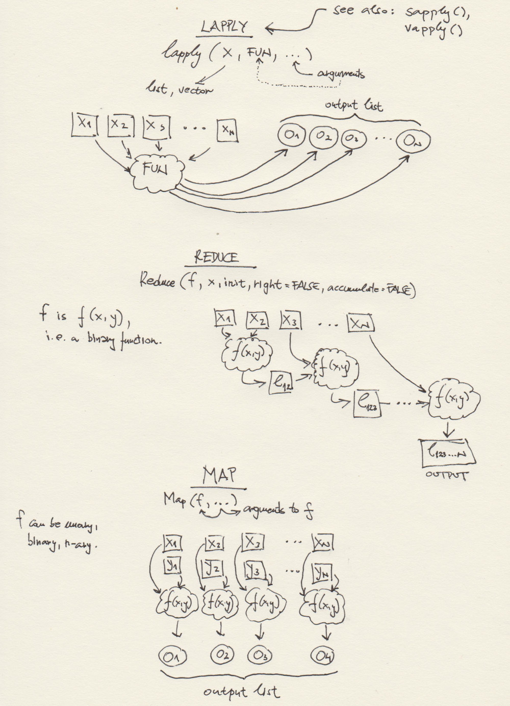

***
# Session 03: Control flow + Functional programming in R 
**Feedback** should be send to `goran.milovanovic@datakolektiv.com`. 
These notebooks accompany the Intro to Data Science: Non-Technical Background course 2020/21.

***

### What do we want to do today?

We study a practical problem of dealing with many dataframes with identical (or nearly identical) columns: that would be similar to a set of tables with identical schemata in the world of [Relational Database Management Systems (RDBMS)](https://en.wikipedia.org/wiki/Relational_database). In the near future we will start drawing parallels between working with dataframes in R and the relationally structured tables in RDBMS like [MySQL](https://www.mysql.com/), [MariaDB](https://mariadb.org/), [PostgreSQL](https://www.postgresql.org/), and similar. While learning how to manage a set of dataframes we start introducing the R *control flow*: various iterations like *for*, *repeat*, and *while* loops, and decision making with *if ... else* and *switch*. Of course, we recognize the nature of R as a functional and vectorized programming language, so we immediately show how to avoid using a loop when `lapply()` or any of its sisters - like `Reduce()` that we will introduce in this session - can do the job. We want our code to be a series of mappings from input data through various transformations onto the results, and consider everything else to be what is called *a glue code*. We will later show how {dplyr}, {tidyr}, and other packages are perfectly suited for that purpose. 


### 0. Prerequisits.

- Create a directory named `_data` in the directory where you want to store your R code for this session. 
- Go to the [Inside Airbnb](http://insideairbnb.com/get-the-data.html) page and download the following `.csv` files:
  (1) [`listings.csv`](http://data.insideairbnb.com/the-netherlands/north-holland/amsterdam/2020-12-12/visualisations/listings.csv) `csv` file (under the *Amsterdam, North Holland, The Netherlands* section);
  (2) [`listings.csv`](http://data.insideairbnb.com/belgium/vlg/antwerp/2020-10-26/visualisations/listings.csv) `csv` file (under the *Antwerp, Flemish Region, Belgium* section);
  (3) [`listings.csv`](http://data.insideairbnb.com/united-states/nc/asheville/2020-11-08/visualisations/listings.csv) `csv` file (under the *Asheville, North Carolina, United States* section);
  (4) [`listings.csv`](http://data.insideairbnb.com/greece/attica/athens/2020-10-25/visualisations/listings.csv) `csv` file (under the *Athens, Attica, Greece* section).
- Rename the files in the order of their download in the following way: (1) `listings_amsterdam.csv`, (2) `listings_antwerp.csv`, (3) `listings_asheville.csv`, and (4) `listings_athens.csv`. Remember: all files should reside in your `_data` directory.


### 1. Read several dataframes and then compose one large dataframe: `for` loops, `lapply()`, and `Reduce()`

All the `listings_*.csv` files should be found in your `_data` directory for this session:


```{r echo = T}
dataDir <- paste0(getwd(), "/_data/")
list.files(dataDir)
```

Good. There is highly typical situation in Data Science in which some data collection systems have a regular data production update: for example, the datasets encompassing some observations that need to be analyzed are produced every hour on a company server, but the analysis and reporting need to take place only once a day. That means that every time a Data Scientist needs to analyze the new observations - most probably by relying on a highly automated data processing, modeling, and visualization pipeline that they have carefully designed and tested - they need to load 24 (i.e. one per hour) datasets for processing. In this example we are assuming that all such datasets have the same structure, and that means: the column names and the respective data types are always the same (we will see how to deal with the violations of this assumption later).

The first approach to acquire multiple tabular data at once in R is to use *iterations*. In R, we have the `for` loop, the `repeat` loop, and the `while` loop at our disposal. Let's start with the `for` loop - probably the most common one.

```{r echo = T}
# - how many files to read from /_data
num_files <- length(list.files(dataDir))
num_files
```
So there are four `.csv` files there. Ok:

#### 1.1 The `for` loop

```{r echo = T}
# - list files
files <- list.files(dataDir)
# - how many files there are:
num_files <- length(list.files(dataDir))
# - prepare a list to store the dataframes
dataSet <- list()
# - load all datasets, one by one, in a for loop:
for (i in 1:num_files) {
  dataSet[[i]] <- read.csv(paste0(dataDir, files[i]), 
                           header = T, 
                           stringsAsFactors = F)
}
```

The `dataSet` variable is now a list with four elements, each of them encompassing one dataframe: the result of a `read.csv` call over `files[1]`, `files[2]`, `files[3]`, and `files[4]`. We will get back to our data soon. Let's discuss the `for` loop in R first: it is simple.

The `(i in 1:num_files)` part of the `for` loop syntax tells R that `i` needs to take values from `c(1,2,3,4)` exactly in that order, because:

```{r echo = T}
1:num_files
```
We use the `i` variable in the `for` loop to single out exactly what file name from the `files` vector do we need in each iteration: that is the `paste0(dataDir, files[i]` part that presents the first argument to `read.csv()`. What is found between `{` and `}` is a **code block**: that is what will be executed in each iteration of the `for` loop, all the way until `i == num_files` is `TRUE`.

In effect, R has started from `i = 1` and increased `i` until it reached the value of `num_files`, each time executing what is found in the code block following the definition of the `for` loop, and using `i` as a parameter to alter what `read.csv()` will do. In each iteration, `i` was also used to index an element of the `dataSet` list: `dataSet[[i]]`. Finally, `dataSet` became a list with four elements, each being a dataframe holding one dataset from our `_data` directory.

`For` loops are realy simple:

```{r echo = T}
for (a in 1:10) print(a)
```

```{r echo = T}
names <- c('Maria', 'Ann', 'Peter', 'Jovan', 'Ilke')
for (x in 1:length(names)) {
  print(
    paste0("This is a beatiful name: ", 
           names[x])
  )
}
```

Do you remember `lapply()`?

#### 1.2 The `for` loop vs. `lapply()` and when are the `for` loops inefficient in R

```{r echo = T}
files <- list.files(dataDir)
dataSet <- lapply(paste0(dataDir, files), 
                  read.csv, header = T, stringsAsFactors = F)
```

Yes, we need `for` loops here and there, but **this ^^ is the R way of doing things**:

- `files` is a vector encompassing the filenames of the `.csv` datasets that we need
- `lapply()` is an R function that applies a given function - `read.csv()` - to all elements of the list or a vector given as its first argument (`paste0(dataDir, files)` in this example)
- each function's call result will be assigned to an output list - the result of a `lapply()` call
- and the output is finally assigned to `dataSet`.

There is a myth saying that `for` loops in R are slow. Well, they can be. But using `lapply()` in a functional programming language like R is not just a matter of efficiency: look how code with `lapply()` is elegant and concise in comparison to iterations like the `for` loop!

When **not to** use the `for` loop in R (if you ask me: never, if you don't have to)?

The typical context that slows down R code execution is the one in which a data structure will **grow** inside the loop:

```{r echo = T}
numbers <- numeric()
for (i in 1:100) {
  numbers[i] <- i
}
```

First, there is absolutely no need to do such things in a vectorized language like R:

``` {r echo = T}
numbers <- 1:100
```

is enough, of course. The more important thing is that growing data structures in loops slows down the code execution and significantly in some situations (when the data structure is really large, for example). How can we use a more efficient `for` loop if we have to grow a data structure in it? Tell R how much memory is needed to hold the respective data structure:

```{r echo = T}
# - list files
files <- list.files(dataDir)
# - how many files?
num_files <- length(list.files(dataDir))
# - prepare a list to store the dataframes
dataSet <- vector(mode = "list", length = num_files)
# - iterate:
for (i in 1:num_files) {
  dataSet[[i]] <- read.csv(paste0(dataDir, files[i]), 
                           header = T, 
                           stringsAsFactors = F)
}
```

We have used `vector(mode = "list", length = num_files)` to create an empty list of length `num_files`:

```{r echo = T}
emptyList <- vector(mode = "list", length = 4)
emptyList
```
And `NULL` means *this does not exist* in R, different from `NA` in vectors and dataframes which means: we expect and element in this place but we do not observe one.

#### 1.3 Compose one dataframe from several dataframes stored in a list: `Reduce()`

We know that `dataSet` has four elements and that each of them is an `data.frame`:

```{r echo = T}
lapply(dataSet, class)
```

Now, say that the analyst needs to put all these dataframes together in a single dataframe for the purposes of statistical modeling. Take a look at the following code first and than we will discuss it in detail:

```{r echo = T}
listings <- Reduce(rbind, dataSet)
dim(listings)
```
Do the four datasets have `31852` rows in total?

```{r echo = T}
sum(sapply(dataSet, function(x) dim(x)[1]))
```
Yes, they do: `listings` is now the dataframe that we need. But what was that `Reduce()` thing?

> "Reduce() takes a function f of two arguments and a list or vector x which is to be ‘reduced’ using f. The function is first called on the first two components of x, then with the result of that as the first argument and the third component of x as the second argument, then again with the result of the second step as first argument and the fourth component of x as the second argument etc. The process is continued until all elements of x have been processed." - From **R: Reduce() – apply’s lesser known brother**, the [Data Science made in Switzerland](https://blog.zhaw.ch/datascience/r-reduce-applys-lesser-known-brother/) blog.

Let' see:

```{r echo = T}
numbers <- c(1, 2, 3, 4)
Reduce('^', numbers)
```
Of course, because: `1^2 = 1`, `1^3 = 1`, `1^4 = 1`, but **it does work that way**, I assure you:

```{r echo = T}
numbers <- c(4, 3, 2, 1)
Reduce("^", numbers)
```
because `4^3 = 64`, `64^2 = 4096`, and `4096^1 = 4096`. If you are interested to see the intermediate results of `Reduce()`, set its `accumulate` argument to `TRUE`:

```{r echo = T}
numbers <- c(4, 3, 2, 1)
Reduce("^", numbers, accumulate = T)
```
So what happened in our `listings <- Reduce(rbind, dataSet)` call is the following: (a) `dataSet` is a list of four dataframes, (b) `rbind` is a function that takes two arguments, both dataframes, and puts them on top of each other (mind the column names!), so (c) `Reduce()` began by binding the first two elements of `dataSet` together, then used the resulting dataframe as its next input together with the third element of `dataSet`, and finaly used that resulting dataframe as its first argument together with the fourth element of `dataSet` as its second argument to produce the `listings`.

**Note.** You have noticed that I have used the `^` operator in R as if it were a function in `Reduce('^', numbers)`. That is because it is a function in R, look:

```{r echo = T}
'^'(2, 3)
```
Similarly, 

```{r echo = T}
'+'(2, 3)
```

That is why we call it a *functional* programming language - and a beautiful one indeed.

#### 1.4 A concise overview of some R functions used in functional programming

Here is a schematic overview of some R functions that are typically used in functional programming. The one at the bottom - `Map(f, ...)` - we have not used yet. But we will, at some point, and it is also pretty intuitive, e.g. for two lists, `x`, `y`, and a binary function `f(x,y`), `Map(f, x, y)` returns `f(x[[1]], y[[1]]), f(x[[2]], y[[2]]), .., f(x[[n]], y[[n]])`. `Map()` can use n-ary functions, i.e. `f` can have as many arguments as needed.



#### 1.5 Enter a new column into each dataframe and compose: `strsplit()` and `gsub()`

Finally, there is one problem with `listings`: we do have all the data in one place, but we do not know from which original dataset (Amsterdam, Antwerp, Asheville, Athens) do the data come from. Let's fix this. Remember that we have the filenames in `files`:

```{r echo = T}
files
```

What happens if...


```{r echo = T}
strsplit(files[1], split = "_")
```

Ok, so `strsplit()` takes a string (`files[1]`) in this example) and splits it up where it finds the character provided in its `split` argument (and that would be `"_"` in this example) - and returns a list.

Ok, and what happens if...

```{r echo = T}
gsub(".csv", "", strsplit(files[1], split = "_")[[1]], fixed = T)
```
`gsub()` - a relative of `grepl()` will substitute its first argument by its second argument in a given string:

```{r echo = T}
gsub("A", "E", "Amelia")
```
So 

```{r echo = T}
gsub(".csv", "", strsplit(files[1], split = "_")[[1]], fixed = T)
```

will first `strsplit` the `files[1]` string by "_", and we use [[1]] in order to grab the result because it returns a list; `gsub()` then replaces `".csv"` with an empty string `""`, and we need to specify `fixed = T` to inform `gsub()` that we do not wish the `.` to be interpreted as `regex` (where it means: *any character*) but literally as a `.` character. The remaining thing to do is to pick up the city which is found in the second position of the output vector:

```{r echo = T}
gsub(".csv", "", strsplit(files[1], split = "_")[[1]], fixed = T)[2]
```
And we could have accomplished the same by:

```{r echo = T}
gsub(".csv", "", strsplit(files[1], split = "_")[[1]][2], fixed = T)
```
because `strsplit` returns a list of length two (`[[1]] 'listings' 'amsterdam.csv'` in this example).

So here is how we get to the cities that we need for our datasets:

```{r echo = T}
cities <- sapply(files, function(x) {
  gsub(".csv", "", strsplit(x, split = "_")[[1]][2], fixed = T)
})
cities
```
It is named vector, with names returned from the `sapply()` call. We can `unname()` that:

```{r echo = T}
cities <- unname(cities)
cities
```
Now, we need to produce `listings` with a new column: `listings$city`. How do we accomplish that?

```{r echo = T}
for (i in 1:length(cities)) {
  dataSet[[i]]$city <- cities[i]
}
listings <- Reduce(rbind, dataSet)
table(listings$city)
```

And now we can answer questions like: what is the average price per AirBnB post per city, and similar:

```{r echo = T, message = F}
library(dplyr)

listings %>% 
  select(city, price) %>%
  group_by(city) %>% 
  summarise(mean_price = mean(price))

```
Ooops, what is `{dplyr}`? That comes later. What I wanted to do this in base R?

```{r echo = T}
city <- unique(listings$city)
mean_price <- unname(sapply(city, function(x) {
  w <- which(listings$city == x)
  return(mean(listings$price[w]))
}))
data.frame(city, mean_price)
```
But the beauty of {dplyr}! You will see..!

### 2 Beyond `for`: `while` and `repeat` loops, `next` and `break`

As many other programming languages, R makes use of `while` loops and `repeat` loops as well. Let's see how do they differ from the `for` loop by means of very simple examples only: 

```{r echo = T}
counter <- 0
while (counter <= 100) {
  counter <- counter + 1
  if (counter %% 10 == 0) {
    print(counter)
  }
}
```

In the `while` loop, we begin by checking if the loop *exit condition* is satisfied *before* executing the code block in an iteration. We began by setting `counter` to zero; then we ask if it is less or equal than `100`, and if that condition is true we execute the code block, increase the value of `counter` only *inside* the block.

We have also used our first `if` in R:

```{r echo = T}
if (counter %% 10 == 0) {
    print(counter)
}
```

And this expression does not print anything because `counter` has already reached `101` in the `while` loop (why?), while the condition `counter %% 10 == ` specifies that only if the remainder after dividing `counter` with `10` is equal to zero.

The `repeat` loop, to the contrary, begins by executing what is in its code block and stops only if a certain condition in the block is satisfied:

```{r echo = T}
counter <- 0
repeat {
  counter <- counter + 1
  if (counter %% 10 == 0) {
    print(counter)
  }
 # - exit condition:
  if (counter > 100) {
    break
  }
}
```

Remember: you **have to** `break` the `repeat` loop in R somehow: specify a condition, and if the condition is satisfied, end the loop execution by `break`! Unless you are able to break it will run FOREVER and inflate the Universe with computing!

We can also use `break` in a `for` loop to exit altogether: 

```{r echo = T}
for (counter in 1:100) {
  if (counter %% 10 == 0) {
    print(counter)
  }
  # - exit condition
  if (counter > 50) {
    break
  }
}
```
The loop would iterate until `counter` reaches `100`, as specified in `for (counter in 1:100)`, but we have introduced an exit condition by `if (counter > 50) {break}` so it did not.

Finally, there is `next`, telling the loop to abandon the execution of the current iteration and start the next one if some condition is satisfied:

```{r echo = T}
for (counter in 1:100) {
  
  if (!(counter %% 10 == 0)) {
    next
  } else {
    print(counter)
  }
  
  print("Remainder is zero!")
  
}
```

The result is similar to what we have seen before, but the code is modified. The `!` unary operator in R is *negation*, so `(!(counter %% 10 == 0))` means: the remainder of division by ten of `counter` is not equal to zero. And if that is so, we want to skip the current iteration (and that is why `print("Remainder is zero!")` does not execute) and start the next one. Of course, `break` and `next` can be combined in a single loop.

Also, we have used to `if ... else` syntax to make a decision in R. We will next discuss decisions in control flow more closely.

### 3 Decisions: `if...else`, `switch()`, and `ifelse()`

#### 3.1 `if...else` is simple

The usage of `if ... else` in R is really simple. Let's begin with:

```{r echo = T}
num_rows <- dim(listings)[1]

if (num_rows >= 10000) {
  print("Listings have more than 10,000 rows!")
} else {
  print("Listings is a very small dataset.")
}
```

The `if ... else` constructs can be nested:

```{r echo = T}
num_rows <- dim(listings)[1]
num_cols <- dim(listings)[2]

if (num_rows >= 10000) {
  print("Listings have more than 10,000 rows!")
  if (num_cols > 10) {
    print("And it has more than ten columns!")
  } else {
    print("But it has less than ten columns!")
  }
} else {
  print("Listings is a very small dataset.")
  if (num_cols > 10) {
    print("And it has more than ten columns!")
  } else {
    print("But it has less than ten columns!")
  }
}

```
And we can chain `if ... else` indefinitely:

```{r echo = T}
this_number <- 5
if (this_number > 10) {
  print("This number is less than ten...")
} else if (this_number < 5) {
  print("This number is less than five.")
}
```

Nothing happens, of course, because `this_number` is exactly five. However,

```{r echo = T}
this_number <- 5
if (this_number > 10) {
  print("This number is less than ten...")
} else if (this_number <= 5) {
  print("This number is less or equal to five.")
}
```
#### 3.2 `switch()` for multiple checks + `ifelse()` for binary decisions

Is `this_animal` a dog, an elephant, a cat, or a tiger?

```{r echo = T}
this_animal <- 'tiger'

switch(this_animal,
       "dog" = "It's a dog!",
       "elephant" = "It's an elephant!", 
       "cat" = "Meow!", 
       "tiger" = "A tiger? In Africa?")
```

Let's analyze how this works. First, `this_animal` was set to `'tiger'`. Then it was used as an expression in `switch()` which searches through the list of provided alternatives and returns the result from the match. In this case, a match between `this_animal` and `"tiger"` determined that the response should be `"A tiger? In Africa?"`

Let's invoke a `"Meow!` response from a `"cat"`:

```{r echo = T}
this_animal <- 'cat'
switch(this_animal,
       dog = "It's a dog!",
       elephant = "It's an elephant!", 
       cat = "Meow!", 
       tiger = "A tiger? In Africa?")
```
And let's try with some numbers:

```{r echo = T}
this_number <- 1
switch(this_number,
       "It's the first one!",
       "It's the second one!", 
       "It's the third one one!",
       "It's the fourth one!")
```

```{r echo = T}
this_number <- 4
switch(this_number,
       "It's the first one!",
       "It's the second one!", 
       "It's the third one one!",
       "It's the fourth one!")
```
You can use code blocks in `switch()`, of course:

```{r echo = T}
some_expression = 'hey'
switch(some_expression, 
       hey = { 
         print(2 + 2)
         print('Hey!') 
         },
       hi = { 
         print(5 + 5)
         print('Hi!')
         },
       {
         print(6 * 3)
         print('Default case!')
         }
       )
```
The default case is triggered if `switch()` cannot find a match:

```{r echo = T}
some_expression = 'Ciao'
switch(some_expression, 
       hey = { 
         print(2 + 2)
         print('Hey!') 
         },
       hi = { 
         print(5 + 5)
         print('Hi!')
         },
       {
         print(6 * 3)
         print('Default case!')
         }
       )
```
A practical application of `switch()`? Let's check if all dataframes in `dataSet` have the same column names and report accordingly:

```{r echo = T}
columns <- lapply(dataSet, colnames)
columns
```

Learn about `identical()`:

```{r echo = T}
identical(columns[[1]], columns[[2]])
```

Are all pairs in `columns` identical? Learn about `combn()`:

```{r echo = T}
combn(1:4, m = 2)
```
Let's coordinate now:

```{r echo = T}
search <- combn(1:length(columns), 2)
apply(search, 2, function(x) {
  identical(columns[x[1]], columns[x[2]])
})
```
This was our first usage of `apply()`: take a matrix like `search`, apply(`X`, `MARGIN`, `FUN`) where we apply `FUN` across rows with `MARGIN = 1` and across columns with `MARGIN = 2`. To obtain row sums, for example:

```{r echo = T}
apply(search, 1, sum)
```
And to obtain sums across the columns:

```{r echo = T}
apply(search, 2, sum)
```
And of course R has functions for this: `rowSums()` and `colSums()` - you can try them out if you wish.

So, let's report if all of the column names of the dataframes in `dataSet` are identical:

```{r echo = T}
columns <- lapply(dataSet, colnames)
search <- combn(1:length(columns), 2)
check <- apply(search, 2, function(x) {
  identical(columns[x[1]], columns[x[2]])
})
num_pairs <- dim(search)[2]
dataFramesCheck <- ifelse(num_pairs == sum(check), 1, 2)
switch(dataFramesCheck, 
       "All dataframes have the same columns; you can proceed with code execution.", 
       "Inconsistent column names; try using datatable::rbindlist() with fill = T.")
```
**NOTE.** the `ifelse()` function in R is new. It is a vectorized function that first checks for the condition in its first argument (which needs to evaluate to `TRUE` or `FALSE`), and then if `TRUE` executes the expression found in its second argument, and otherwise executes what is found in its third argument:

```{r echo = T}
ifelse(10 < 5, 
       "I do not understand basic arithmetics.", 
       "Ok I got at least that one right."
       )
```
**NOTE.** Obviously, we could have used just `ifelse()` for this task:

```{r echo = T}
columns <- lapply(dataSet, colnames)
search <- combn(1:length(columns), 2)
check <- apply(search, 2, function(x) {
  identical(columns[x[1]], columns[x[2]])
})
num_pairs <- dim(search)[2]
ifelse(num_pairs == sum(check), 
       "All dataframes have the same columns; you can proceed with code execution.", 
       "Inconsistent column names; try using datatable::rbindlist() with fill = T.")
```


---

**SUMMARY.** We have learned about the basics of R programming in this session. The focus was twofold: (a) we have learned about the control flow, which is similar in R and in almost any other programming language: `for`, `while`, `repeat` loops, and decision making with `if ... else`, `switch()`, and `ifelse()`; on the other hand, we have touched upon functional programming in R with `apply()`, `lapply()`, `sapply()`, `Reduce()`. Do not forget: we really love functional programming in R. It makes the code more consistent and elegant, if anything. Functional programming is perfectly suited for Data Science projects because it allows us to formulate and solve the problem as a chain of functional transformations across the input data. An ideal Data Science code - not something that can be always achieved - is nothing more than that.

---

### Further Readings

- [Chapters 7.1 to 7.6 from Norman Matloff’s The Art of R Programming](https://www.google.com/search?client=firefox-b-d&channel=trow2&sxsrf=ALeKk03T_qLCMzRICYWj5UHqFBHnvfV6Uw%3A1607220795553&ei=Oz7MX8aeIYK6kwWc5JbgAw&q=Norman+Matloff+The+Art+of+R+Programming+pdf&oq=Norman+Matloff+The+Art+of+R+Programming+pdf&gs_lcp=CgZwc3ktYWIQAzIFCAAQyQM6BwgjEMkDECc6AgguUJk9WOdAYKRBaABwAHgAgAGHAYgB9QOSAQMwLjSYAQCgAQGqAQdnd3Mtd2l6wAEB&sclient=psy-ab&ved=0ahUKEwiGqOCEpLjtAhUC3aQKHRyyBTwQ4dUDCAw&uact=5)
- [How to write the first for loop in R from R-bloggers](https://www.r-bloggers.com/2015/12/how-to-write-the-first-for-loop-in-r/)
- [While Loop in R with Example from Guru99](https://www.guru99.com/r-while-loop.html)
- [R - Repeat Loop from Tutorials Point](https://www.tutorialspoint.com/r/r_repeat_loop.htm)

### Highly Recommended To Do

- [Chapter 19 Functions from R for Data Science](https://r4ds.had.co.nz/functions.html)
- [Chapter 20 Vectors from R for Data Science](https://r4ds.had.co.nz/vectors.html)
- [Chapter 21 Iterations from R for Data Science](https://r4ds.had.co.nz/iteration.html)


### Important sources, documentation, etc.

- [Quick-R](https://www.statmethods.net/) - An excellent set of concise R tutorials.
- [CRAN: The Comprehensive R Archive Network](https://cran.r-project.org/) - This is were the official versions of R packages live
- [Colors in R (PDF)](https://www.google.com/url?sa=t&rct=j&q=&esrc=s&source=web&cd=&ved=2ahUKEwjXhNPIu_TtAhVSkMMKHRx6A3QQFjABegQIAhAC&url=http%3A%2F%2Fwww.stat.columbia.edu%2F~tzheng%2Ffiles%2FRcolor.pdf&usg=AOvVaw1XIn-mwZ73RgG8bxh4Lan4)
- [ggplot2 Reference](https://ggplot2.tidyverse.org/reference/)
- [RDocumentation: Search all 21,217 CRAN, Bioconductor and GitHub packages](https://www.rdocumentation.org/)

### R Markdown

[R Markdown](https://rmarkdown.rstudio.com/) is what I have used to produce this beautiful Notebook. We will learn more about it near the end of the course, but if you already feel ready to dive deep, here's a book: [R Markdown: The Definitive Guide, Yihui Xie, J. J. Allaire, Garrett Grolemunds.](https://bookdown.org/yihui/rmarkdown/) 

### Exercises

- **E1.** In the beginning of this session we have used the `for` loop to load four datasets into a list of dataframes in R. Do the same, but use the `repeat` loop instead.

- **E2.** Same as **E1** but use the `while` loop in place of `repeat`.

- **E3.** Produce a new column of logicals (`TRUE`, `FALSE`), `listings$priceClass` in `listings` that is `TRUE` if `listings$price` is above or equal to its median, and `FALSE` if it is strictly lower than its median. **Hint:** Use `ifelse` to create the new column. Try to summarize your data by using `summary()` on `listings$price`. What does `summary(listings)` look like?

- **E4.** Produce a new column in `listings`: `listings$priceNightsRation`, which is the ratio of `listings$minimum_nights` and `listings$price`.

- **E5.** Take a look at the following R code:

```{r echo = T, eval = F}
set <- 1:100
for (i in 1:length(set)) {
  if(i == 100) {
    break
    } else {
      if ((i == 1)) {
        z = set[i] + set[i+1]
        print(z)
        } else {
          z = z + set[i+1]
          print(z)
        }
    }
  }
```

Use `Reduce()` to accomplish the same in a one-liner. **Remember** the `accumulate` argument!


***
Goran S. Milovanović

DataKolektiv, 2020/21

contact: goran.milovanovic@datakolektiv.com


***
License: [GPLv3](http://www.gnu.org/licenses/gpl-3.0.txt)
This Notebook is free software: you can redistribute it and/or modify it under the terms of the GNU General Public License as published by the Free Software Foundation, either version 3 of the License, or (at your option) any later version.
This Notebook is distributed in the hope that it will be useful, but WITHOUT ANY WARRANTY; without even the implied warranty of MERCHANTABILITY or FITNESS FOR A PARTICULAR PURPOSE.  See the GNU General Public License for more details.
You should have received a copy of the GNU General Public License along with this Notebook. If not, see <http://www.gnu.org/licenses/>.

***

