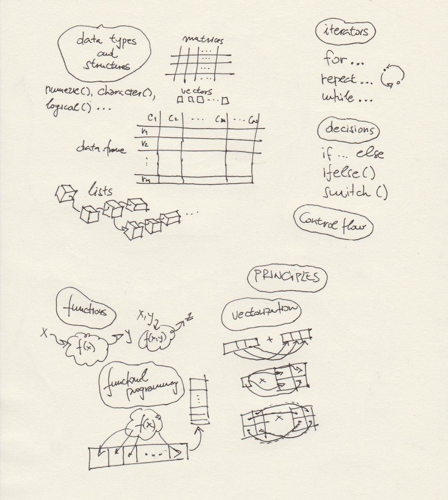

***
# Session 04: Functions and vectorization. Overview: R programming. Some non-tabular data representations: XML and JSON. 
**Feedback** should be send to `goran.milovanovic@datakolektiv.com`. 
These notebooks accompany the Intro to Data Science: Non-Technical Background course 2020/21.

***

### What do we want to do today?

Exactly as the [Course Overview](http://datakolektiv.org/app_direct/introdsnontech/overview.html#week-4) states: *"Week 4. Serious programming in R begins: functions, vectorization. More data formats and structures (simple things in JSON and XML). Overview: data types and structures, control flow, functions and functional programming. Why do we have different and rich data structures in R: the philosophy of functional programming."*
This session encompasses three "units". In the first one (sections 1, 2) we will learn about user-defined functions in R, introduce matrices, and discuss vectorization in R. We will use the second third of our time in this session to provide an overview of (almost) everything learned about R thus far: data types and structures (i.e. *classes*), control flow, and functions and functional programming - in an attempt to start synthesizing our knowledge of R programming. Finally, and while we are still at the beginning of our journey, we introduce [XML](https://www.w3schools.com/xml/xml_whatis.asp) and [JSON](https://www.json.org/json-en.html) data formats in order to discover the world of non-tabular data representation. These two formats will be of uttermost importance to us when we start contacting [REST APIs](https://www.smashingmagazine.com/2018/01/understanding-using-rest-api/) from our R environments to obtain data. 


### 0. Prerequisits.

Install the following packages:

```{r echo = T, eval = F, message = F}
install.packages('XML')
install.packages('jsonlite')
install.packages('httr')
```

`{XML}` is a well-know R package to manipulate, load, and store data in the XML format, while `{jsonlite}` does the same for JSON.

### 1. Functions

We have already used a myriad of R functions: `lapply()`, `sapply()`, `print()`, `paste0()`, `unique()`, `c()`... And now we want to become able to write our own, user-defined functions! Think of a function as a piece of reusable code that can be called upon whenever we need it to perform the same action. Also, functions can vary in their application, and that variability is controlled by their arguments, `paste0(a, b)` will do a different thing when `a <- 5; b <- "Alpha"` and when `a <- "Beta"; b <- 3". It is **really easy** to define a function in R:

```{r echo = T}
sumAB <- function(a, b) {
  return(a + b)
}
```

#### 1.1 Functions: their arguments and behaviour

Upon executing this code, we find a new object in our R environment, a function `sumAB`:

```{r echo = T}
ls()
```
So, let's start getting used to the fact that functions in R are first-class citizens and can perform many things that variables and other objects can: for example, a function can be an argument to another function, a function can return a function as its output... Let's call `sumAB()` on some values:

```{r echo = T}
result <- sumAB(a = 10, b = 2)
print(result)
```
The function `return()` used inside the `sumAB()` function tells R what is the function output. In an assignment of `result <- sumAB(a = 10, b = 2)`, that output will be assigned to the `result`. You do not have to use `return()`, in which case R will return the result of the last evaluation inside the function as its output, so

```{r echo = T}
sumAB <- function(a, b) {
  a + b
}
```

works just nice. But it is a **convention** to always use `return()`.

In the previous call to `sumAB` we have explicitly used the argument names, `a` and `b`. However, it would also work if we did this:

```{r echo = T}
result <- sumAB(10, 2)
print(result)
```
How did R knew that `a` should be `10` and `b` set to `2`? There are three ways in which R determines the binding of the *actual arguments* - the one supplied in a function call - to the *formal arguments* - the ones supplied in the definition of the function. `sumAB(10, 2)` worked by interpreting `10` and `2` as positional arguments - because no formal argument names `a` and `b` were provided - and thus bound `a = 10` and `b = 2`. What else can happen?

First, match by argument names:

```{r echo = T}
sumAB(a = 5, b = 2)
```
Second, match by position:

```{r echo = T}
sumAB(5, 2)
```
Then, we can have a partial match by argument name (when the match is unambiguous):

```{r echo = T}
sumAB(2, a = 5)
```
And finally, if we have long formal argument names, we can abbreviate them (again only when the match is unambiguous):

```{r echo = T}
sumSquares <- function(a_Argument, b_Argument) {
  return(a_Argument^2 + b_Argument^2)
}
sumSquares(a_ = 10, 3)
```
#### 1.2 Functions, vectorization, and functional programming

Do not be surprised by the following:

```{r echo = T}
squares <- function(x) {
  return(x^2)
}
someVector <- 1:10
squares(someVector)
```
"What - my functions are vectorized?" - Well, if you use vectorized base R functions to compute their value - such as `"^"()` - yes, they are :) - Vector in, `^` - vector out. Such a beautiful programming language. Look:

```{r echo = T}
sumSquares <- function(x, y) {
  return(x^2 + y^2)
}
a <- 1:10
b <- 11:20
sumSquares(a, b)
```
**Note.** Do not ever forget about **recycling** in R. Never.

Remember `Map()`, only mentioned in our `Session03`? Look:

```{r echo = T}
summa <- function(x, y) {
  return(x + y)
}
a <- 1:10
b <- 11:20
unlist(Map(summa, x = a, y = b))
```
Or:

```{r echo = T}
summa <- function(x) {
  return(x[1] + x[2])
}
arguments <- list(c(1, 11), 
                  c(2, 12), 
                  c(3, 13), 
                  c(4, 14), 
                  c(5, 15),
                  c(6, 16), 
                  c(7, 17), 
                  c(8, 18), 
                  c(9, 19), 
                  c(10, 20))
unlist(lapply(arguments, summa))
```
In other words: of course you can do with your own functions whatever you were able to do with the in-built R functions.

#### 1.3 Scoping

Take a look at the following example:

```{r echo = T}
b <- 10
myFun <- function(a) {
  b <- 5
  return(a + b)
}
result <- myFun(3)
```

What will be the value of `result`: `13`, or `8`? Let's see:

```{r echo = T}
print(result)
```
Ok: how did R know that `b` should be `5` (as defined inside the `myFun` function) and not `10` (as defined outside the function and before it was introduced)?

**Variable Scoping in R simplified.** If there is a variable outside the function bearing the same name as the variable inside the function, the variable inside the function will have priority. In other words, define `b` to be `10` outside the function, and declare `b` to be `3` inside the function, and we you use `b` to compute something inside the function it will have the value of `3` i.e. the one assigned to it inside the function.

Function in R are a serious topic indeed, and we are able to provide a basic introduction here only. To learn about nuances and observe R functions in all their beauty, refer to the [Functions, Chapter 6 in Hadley Wickham, Advanced R ](https://adv-r.hadley.nz/functions.html).

#### 1.4 Creating functions on the fly

Imagine creating a function that can be customized for specific needs every now and then? For example, to create a function that returns `x^n` for a given `n`:

```{r echo = T}
createPower <- function(exp) {
  f <- function(x) {x^exp}
  return(f)
}
```

`createPower()` is a *function factory*: it returns a function after customizing it for one given argument, `exp` in this case. Now we can easily create functions that return `x^2`, `x^3`, etc:

```{r echo = T}
square <- createPower(2)
square(4)
```
```{r echo = T}
cube <- createPower(3)
cube(10)
```

### 2. Vectorization, matrices, and sequences

Here is a glimpse at what follows in Session05 on vectorization and vector arithmetic. We have met various beings in R already, but I think that we were not introduced to matrices yet:


```{r echo = T}
square <- matrix(1:4, 
                 nrow = 2)
square
```

Good. Now, what happens if:

```{r echo = T}
square <- matrix(1:4, 
                 nrow = 2)
constant <- 10
constant*square
```
Vectorization. Look:

```{r echo = T}
square <- matrix(1:4, 
                 ncol = 2)
constant <- 2
square^constant
```
Similarly:

```{r echo = T}
constant <- 2
(1:10)^constant
```
Do not confuse vectorization with linear algebra:

```{r echo = T}
square1 <- matrix(1:4, 
                 nrow = 2)
square2 <- matrix(rep(10, 4), 
                  nrow  = 2)
square1 * square2
```
But that is **not** how matrices are multiplied:

```{r echo = T}
square1 <- matrix(1:4, 
                 nrow = 2)
square2 <- matrix(rep(10, 4), 
                  nrow  = 2)
square1 %*% square2
```
Right? Check it out manually to confirm. So, `*` is a vectorized operator (a function, in fact) in R, while `%*%` is a matrix multiplication operator. We will cover more about vector arithmetics in our next Session05.

`rep()` and `seq()` both produce vectors in R. `rep()` takes two arguments, `x` which is a vector, and `times` which explains how many times should `X` be repeated:

```{r echo = T}
myVec <- c("Paris", "London", "New York")
rep(x = myVec, times = 4)
```
But also:

```{r echo = T}
square <- matrix(1:4,
                 nrow = 2)
rep(square, 3)
```
Note how `square` was stripped to a numeric vector when `rep()` was applied to it. Also, `times` can play a different role if a vector is provided:

```{r echo = T}
myVec <- c("Paris", "London", "New York")
rep(x = myVec, times = 1:3)
```
`seq()`:

```{r echo = T}
seq(from = 10, to = 100, by = 10)
```
Easy.

Matrix subsetting is similar to what can be done with a dataframe:

```{r echo = T}
square <- matrix(1:9,
                 nrow = 3)
square
```

```{r echo = T}
square[1, 1]
```
```{r echo = T}
square[2, 2]
```
Subsetting rows:

```{r echo = T}
square[2, ]
```

Subsetting columns:

```{r echo = T}
square[ , 2]
```

```{r echo = T}
square <- matrix(1:9,
                 nrow = 3)
colnames(square) <- paste0("c_", 1:3)
rownames(square) <- paste0("r_", 1:3)
square
```
This is possible; however, `square` is not a `data.frame` class, so `square$c_1` will not work.

The matrix main diagonal:

```{r echo = T}
diag(square)
```
The matrix transpose:

```{r echo = T}
t(square)
```
Sums:

```{r echo = T}
colSums(square)
```
```{r echo = T}
rowSums(square)
```
Let's take a look at the following example: we will multiply the `square` matrix by `c(2, 3)`:

```{r echo = T}
square <- matrix(1:9,
                 nrow = 3)
square
```
Now:

```{r echo = T, warning = F}
square * c(2, 3)
```
**Question for you:** how does R order the elements in a matrix? Do you understand recycling in R fully?


### 3. Overview: R programming

A long, elaborated synthesis of what is learned by now: 
- data types and structures, 
- control flow, 
- functions, functionals (`lapply()`, for example: vector + function enter -> results a function), and functional programming, 
- vectorization. 

What is missing in this (big) picture are the principles of [Object-Oriented Programming (OOP) in R](https://adv-r.hadley.nz/oo.html) which are not covered by this introductory course. Anyways, what is important to understand is that at this point already you are have a nice toolbox of R principles and techniques to develop serious Data Science projects - while our journey has just started!



### 4. Not all data are tabular: a glimpse at XML and JSON

#### 4.1 Various data formats: why? Theory

Until now, we have used only data stored as `.csv` or `.xlsx` files. As we have seen it was possible to map such files 1:1 onto dataframes in R: columns were defined, with the first rows holding column names by convention... However, in Data Science, many times we face the situation in which we have to obtain some data from a source that does not necessarily deliver *"tabular"* data structures. Also, many times we will be facing data structures that are essentially not "tabular": for example, data structures in which some elements contain certain fields which other elements do not - and not because there are missing data, but because sometimes it does not make sense for something to be described by a certain attribute at all. Imagine describing [David Bowie](https://www.wikidata.org/wiki/Q5383), a famous English musician, by a data structure: we can know his date of birth, and the release dates of his albums perhaps, but should be place all that data into one single column? No, because the semantics of such a field would be weird, of course. How would we organize the rows in a dataframe describing David Bowie: the first row describes the person, while other rows describe his works of art? So, we have a column for `dateOfBirth`, and that column has a value in the first row of the dataframe only, and then we have a column for `releaseDate`, and that column holds `NA` in the first row and then a timestamp in all other rows that refer to his albums? Wait, what about his spouse, children, collaborators: assign a row in a dataframe to each one?


No. Of course, a **list** in R would do, correct?

**JSON** (abbr. *JavaScript Object Notation*) and **XML** (abbr.  *eXtensible Markup Language*) are two data-interchange formats that are often used to store and transport data between different systems online. While it is not possible to dive into any details of JSON and XML representations in this session, it is important to make you aware of the fact that you can obtain *any* data from any online (or not) source in JSON or XML from within your R environment, transform them into R lists (or dataframes, if the transformation makes sense), and use them in your work.

In the following examples we will use the [`{httr}`](https://cran.r-project.org/web/packages/httr/vignettes/quickstart.html) package to get in touch with one [REST API](https://towardsdatascience.com/introduction-to-rest-apis-90b5d9676004) on the Internet and obtain some data from it. Think of REST APIs as systems that can understand user requests for data formulated in an URL pointing to an online server, process such requests, and send the data back to the user. In the following examples we will be using the [Wikibase API](https://www.mediawiki.org/wiki/Wikibase/API) to obtain data from [Wikidata](https://www.wikidata.org/wiki/Wikidata:Main_Page), the World's largest open knowledge base that comprises all structured information from Wikipedia and many other sources.

**NOTE.** Not all code in this section will be immediately transparent to you in this Session. We will work with APIs more in the future sessions and learn how to obtain data from them in a step by step fashion. Our immediate goal is to prepare you for what follows in the weeks ahead us: you need to see JSON and XML and start felling comfortable with transferring data from these two data formats into R data structures. Lists, of course. We will analyze some JSON representations online in this Session to get a glimpse of how it used to describe just any data at hand.

#### 4.2 A JSON response from a REST API

Load `{httr}`, `{XML}`, `{jsonlite}`:

```{r echo = T, message = F, warning = F}
library(httr)
library(XML)
library(jsonlite)
```

We will contact the Wikibase API to obtain all data stored in Wikidata on David Bowie (who has a **Q identifier** of Q5383 in this knowlegde base). We will ask the Wikibase API to use JSON to describe its response. Here is how the JSON response will look like: [Wikibase API response](https://www.wikidata.org/w/api.php?action=wbgetentities&ids=Q5383&languages=en).

```{r echo = T}
query <- 
  'https://www.wikidata.org/w/api.php?action=wbgetentities&ids=Q5383&languages=en&format=json'
response <- GET(URLencode(query))
response <- rawToChar(response$content)
response <- fromJSON(response)
class(response)
```
Now, Wikidata is **very complex** (and thus very powerful as a descriptive system; after all, it's goal is to be able to describe *just anything* that we can imagine, talk, and write about), so what `fromJSON()` returns is a nasty, nasty, nested list:

```{r echo = T}
instaceOf_DavidBowie <- response$entities$Q5383$claims$P31
instaceOf_DavidBowie$mainsnak$datavalue$value
```

It is necessary to study the [Wikidata DataModel](https://www.mediawiki.org/wiki/Wikibase/DataModel) carefully in order to be able to navigate the knowledge structures that it describes:

```{r echo = T}
labelOf_DavidBowie <- response$entities$Q5383$labels$en$value
labelOf_DavidBowie
```
However, once you do learn about Wikidata's data model... More than 100 million highly structured items and relations among them will become accessible to you. Order emerges from chaos in this case, I assure you. Besides JSON, there is XML (and many more, but we will focus on these two formats). 

#### 4.3 An XML response from a REST API

Let's get back to the Wikibase API and ask for the same data on David Bowie wrapped in an [XML response](https://www.wikidata.org/w/api.php?action=wbgetentities&ids=Q5383&languages=en&format=xml):

```{r echo = T}
query <- 
  'https://www.wikidata.org/w/api.php?action=wbgetentities&ids=Q5383&languages=en&format=xml'
response <- GET(URLencode(query))
response <- rawToChar(response$content)
response <- xmlParse(response)
response <- xmlToList(response)
```

The English label for David Bowie in Wikidata:

```{r echo = T}
response$entities$entity$labels$label
```

```{r echo = T}
class(response$entities$entity$labels$label)
```

#### 4.4 All names of David Bowie

Now, David Bowie, in all languages available in Wikidata. First, we get the data.

```{r echo = T}
query <- 
  'https://www.wikidata.org/w/api.php?action=wbgetentities&ids=Q5383&format=json'
response <- GET(URLencode(query))
response <- rawToChar(response$content)
response <- fromJSON(response)
```

Second: study the structure of the response, and then `lapply()` across the appropriate set of lists: 

```{r echo = T}
labels <- lapply(response$entities$Q5383$labels, function(x) {
  paste0(x$value, "(", x$language, ")")
})
labels <- paste(labels, collapse = ", ")
print(labels)
```

Didn't I tell you how lists and functional programming are important in R?

### Further Readings

- [Chapter 19, Functions, from from R for Data Science, Hadley Wickham & Garrett Grolemund](https://r4ds.had.co.nz/functions.html)
- [Matrix, from R-tutor ](http://www.r-tutor.com/r-introduction/matrix)
- [Chapter 10, Matrices, from A Short Introduction to R Programming, Manish Patwal](https://bookdown.org/manishpatwal/bookdown-demo/matrices-in-r.html)
- [An Introduction to JSON, from Digital Ocean](https://www.digitalocean.com/community/tutorials/an-introduction-to-json)
- [Introduction to XML, from IBM, by Doug Tidwell](https://www.ibm.com/developerworks/xml/tutorials/xmlintro/xmlintro.html)

### Highly Recommended To Do (and bit advanced at this point...)

- [Chapter 7, Functions are objects, from Norman Matloff’s The Art of R Programming](https://www.google.com/search?client=firefox-b-d&channel=trow2&sxsrf=ALeKk03T_qLCMzRICYWj5UHqFBHnvfV6Uw%3A1607220795553&ei=Oz7MX8aeIYK6kwWc5JbgAw&q=Norman+Matloff+The+Art+of+R+Programming+pdf&oq=Norman+Matloff+The+Art+of+R+Programming+pdf&gs_lcp=CgZwc3ktYWIQAzIFCAAQyQM6BwgjEMkDECc6AgguUJk9WOdAYKRBaABwAHgAgAGHAYgB9QOSAQMwLjSYAQCgAQGqAQdnd3Mtd2l6wAEB&sclient=psy-ab&ved=0ahUKEwiGqOCEpLjtAhUC3aQKHRyyBTwQ4dUDCAw&uact=5)
- [How to Access Any RESTful API Using the R Language, by Andrew Carpenter](https://www.programmableweb.com/news/how-to-access-any-restful-api-using-r-language/how-to/2017/07/21)

### Important sources, documentation, etc.

- [XML Tutorial, W3C](https://www.w3schools.com/xml/)
- [JSON defined](https://www.json.org/json-en.html)
- [JS JSON from w3schools](https://www.w3schools.com/js/js_json_intro.asp)
- [Quick-R](https://www.statmethods.net/) - An excellent set of concise R tutorials.
- [CRAN: The Comprehensive R Archive Network](https://cran.r-project.org/) - This is were the official versions of R packages live
- [Colors in R (PDF)](https://www.google.com/url?sa=t&rct=j&q=&esrc=s&source=web&cd=&ved=2ahUKEwjXhNPIu_TtAhVSkMMKHRx6A3QQFjABegQIAhAC&url=http%3A%2F%2Fwww.stat.columbia.edu%2F~tzheng%2Ffiles%2FRcolor.pdf&usg=AOvVaw1XIn-mwZ73RgG8bxh4Lan4)
- [ggplot2 Reference](https://ggplot2.tidyverse.org/reference/)
- [RDocumentation: Search all 21,217 CRAN, Bioconductor and GitHub packages](https://www.rdocumentation.org/)

### R Markdown

[R Markdown](https://rmarkdown.rstudio.com/) is what I have used to produce this beautiful Notebook. We will learn more about it near the end of the course, but if you already feel ready to dive deep, here's a book: [R Markdown: The Definitive Guide, Yihui Xie, J. J. Allaire, Garrett Grolemunds.](https://bookdown.org/yihui/rmarkdown/) 

### Exercises

- **E1.** Write a function `enlistVectors()` that take three `numeric()` vectors as its arguments and returns a named list encompassing them.

- **E2.** Write a function `mySumSquares` that takes one argument, `x`, and decides (a) if `x` is `numeric`, returns a square of `sum(x)`, but (b) if `x` is a `matrix`, returns a numeric encompassing the squared sums of all its rows. Carefully: if `m <- matrix(1:4, nrow = 2)`, what is `class(m)`?

- **E3.** Write a function that returns a function! Create a function `fixCase(string, how)` that returns (1) a function which transforms all characters in a string to upper case if `how == 'upper'` and (2) transforms all characters in a string to lower case if `how == 'lower'`. Hint: study base R functions `tolower()` and `toupper()`. 

- **E4.** Do you use any online service like Spotify, or a social network like Twitter? Ok, here is what you need to do: find if your service provides an REST API to obtain some data from it, read the API documentation and try to register as an API user. Hint: you will probably need to set a username and obtain your *credentials* (probably an authorization token, or a password, or something similar). In the following sessions we will be using APIs a lot to fetch data from the Internet.


***
Goran S. Milovanović

DataKolektiv, 2020/21

contact: goran.milovanovic@datakolektiv.com


***
License: [GPLv3](http://www.gnu.org/licenses/gpl-3.0.txt)
This Notebook is free software: you can redistribute it and/or modify it under the terms of the GNU General Public License as published by the Free Software Foundation, either version 3 of the License, or (at your option) any later version.
This Notebook is distributed in the hope that it will be useful, but WITHOUT ANY WARRANTY; without even the implied warranty of MERCHANTABILITY or FITNESS FOR A PARTICULAR PURPOSE.  See the GNU General Public License for more details.
You should have received a copy of the GNU General Public License along with this Notebook. If not, see <http://www.gnu.org/licenses/>.

***

