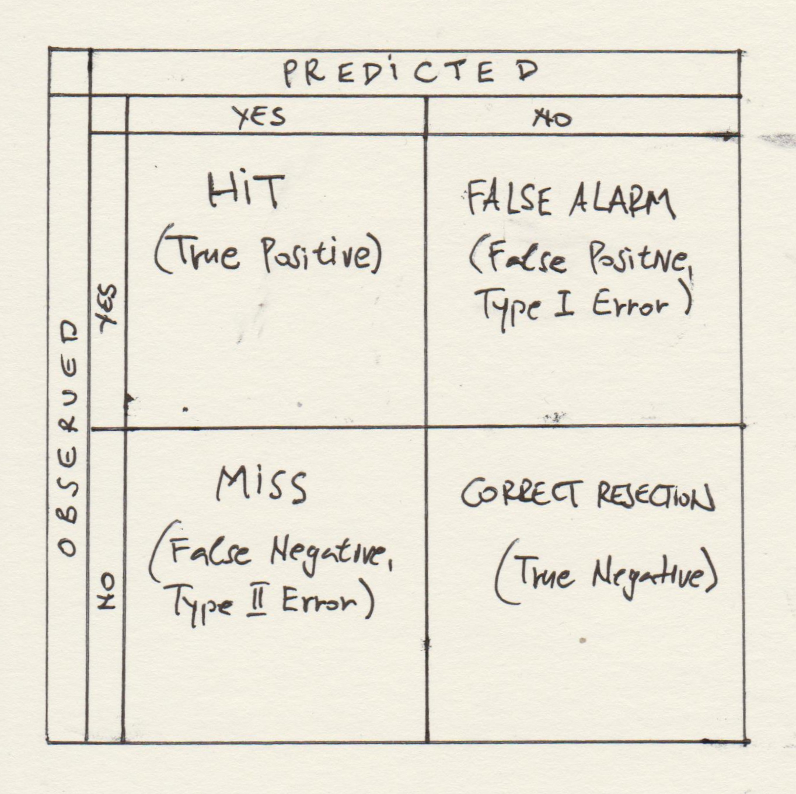

***
# Session 17. Generalized Linear Models II.Multinomial Logistic Regression for classification problems. ROC analysis for classification problems. Maximum Likelihood Estimation (MLE) revisited.

**Feedback** should be send to `goran.milovanovic@datakolektiv.com`. 
These notebooks accompany the Intro to Data Science: Non-Technical Background course 2020/21.

***

### What do we want to do today?

We continue our exploration of Generalized Linear Models (GLMs) by generalizing the Binomial Logistic Regression even further to solve for classification in multiple categories. As we introduce the resulting model of *Multinomial Logistic Regression* we also revisit the theory of the Maximum Likelihood Estimate (MLE). Then we introduce the **Receiver-Operating Characteristic (ROC) Analysis** for classification problems as an important tool in *model selection*: the topic to be explored in detail in our following sessions. 

### 0. Prerequisits

Setup: install {nnet} for Multinomial Logistic Regression.

```{r echo = T, eval = F}
install.packages('nnet')
install.packages('ggrepel')
```

```{r echo = T, message = F, warning = F}
dataDir <- paste0(getwd(), "/_data/")
library(tidyverse)
library(data.table)
library(nnet)
library(car)
library(ggrepel)
```


### 1. MLE revisited


### 2. Multinomial Logistic Regression

The Multinomial Logistic Regression model is a powerful classification tool. Consider a problem where some outcome variable can result in more than two discrete outcomes. For example, a customer visiting a webshop can end up their visit (a) buying nothing, (b) buying some Product A, or (c) Product B, or (d) Product C, etc. If we have some information about a particular customer's journey through the website (e.g. how much time did they spend on some particular pages, did they visit the webshop before or not, or any other information that customers might have chose to disclose on their sign-up...), we can use it as a set of predictors of customer behavior resulting in any of the (a), (b), (c), (d). We do that by means of a simple extension of the Binomial Logistic Regression that is used to solve for dichotomies: enters the Multinomial Logistic Regression model.

#### 2.1 The Model

First, similar to what happens in *dummy coding*, given a set of $K$ possible outcomes we choose one of them as a *baseline*. Thus all results of the Multionomial Logistic Regression will be interpreted as effects relative to that baseline outcome category, for example: for a unit increase in predictor $X_1$ what is the change in odds to switch from (a) bying nothing to (b) buying Product A. We are already familiar with this logic, right?

So, consider a set of $K-1$ independent Binary Logistic Models with only one predictor $X$ where the baseline is now referred to as $K$:

$$log\frac{P(Y_i = 1)}{P(Y_i = K)} = \beta_1X_i$$

$$log\frac{P(Y_i = 2)}{P(Y_i = K)} = \beta_2X_i$$

$$log\frac{P(Y_i = K-1)}{P(Y_i = K)} = \beta_{K-1}X_i$$
**N.B.** The intercept $\beta_0$ is not included for reasons of simplicity.

Obviously, we are introducing a new regression coefficient $\beta_k$ for each possible value of the outcome $k = 1, 2,.., K-1$. The *log-odds* are on the LHS while the linear model remains on the RHS.

Now we exponentiate the equations to arrive at the expressions for *odds*:

$$\frac{P(Y_i = 1)}{P(Y_i = K)} = e^{\beta_1X_i}$$

$$\frac{P(Y_i = 2)}{P(Y_i = K)} = e^{\beta_2X_i}$$

$$\frac{P(Y_i = K-1)}{P(Y_i = K)} = e^{\beta_{K-1}X_i}$$

And solve for $P(Y_i = 1), P(Y_i = 2),.. P(Y_i = K-1)$:

$$P(Y_i = 1) = P(Y_i = K)e^{\beta_1X_i}$$

$$P(Y_i = 2) = P(Y_i = K)e^{\beta_2X_i}$$

$$P(Y_i = K-1) = P(Y_i = K)e^{\beta_{K-1}X_i}$$

From the fact that all probabilities $P(Y_i = 1), P(Y_i = 2), .., P(Y_i = K-1)$ must sum to one it can be shown that

$$P(Y_i = K) = \frac{1}{1+\sum_{k=1}^{K-1}e^{\beta_KX_i}}$$

and then it is easy to derive the expressions for all $K-1$ probabilities of the outcome resulting in a particular class:

$$P(Y_i = 1) = \frac{e^{\beta_1X_i}}{1+\sum_{k=1}^{K-1}e^{\beta_KX_i}}$$

$$P(Y_i = 2) = \frac{e^{\beta_2X_i}}{1+\sum_{k=1}^{K-1}e^{\beta_KX_i}}$$

$$P(Y_i = K-1) = \frac{e^{\beta_{K-1}X_i}}{1+\sum_{k=1}^{K-1}e^{\beta_KX_i}}$$

#### 2.2 Multinomial Logistic Regression in R

Let's begin with a simple example: classify `iris$Species`.

```{r echo = T}
head(iris)
```

Now check if `iris$Species` is a *factor*:

```{r echo = T}
str(iris)
```
Let's pick `versicolor` as our *baseline*: 

```{r echo = T}
iris$Species <- relevel(iris$Species,
                        ref = 'versicolor')
```

Finally, we will use `multinom()` from `{nnet}` to estimate the Multinomial Logistic Regression model:

```{r echo = T, message = F}
mlr_model <- nnet::multinom(Species ~ .,
                             data = iris)
summary(mlr_model)
```

The interpretation of the model results is similar to the Binomial Logistic Regression case. We will discuss the findings on `iris$Species` in the Session.

Grab the model coefficients:

```{r echo = T}
coeffs <- as.data.frame(
  summary(mlr_model)$coeff
  )
print(coeffs)
```

And do not forget the `exp(coefficient)` thing to get back to the odds scale...

```{r echo = T}
exp(coeffs)
```

What are the most influential predictors in categorizing `setosa` and `virginica` vs `versicolor`?

```{r echo = T}
which.max(exp(coeffs)[1, ])
```
```{r echo = T}
which.max(exp(coeffs)[2, ])
```

And we have learned that we can tell `setosa` from `versicolor` by `Sepal.Width` and `virginica` vs `versicolor` by `Petal.Width`! **N.B.** As ever, stop before jumping to conclusions... It is a bit more complicated than that, I assure you.


#### 2.3 Model Accuracy and the ROC analysis

**Q:** How well does the model perform overall? We will first derive the model predictions from the `mlr_model` model object in R:

```{r echo = T}
predictions <- predict(mlr_model,
                       newdata = iris,
                       "probs")
predictions <- apply(predictions, 1, which.max)
table(predictions)
```

Store predictions in `iris` and than compute the model accuracy:

```{r echo = T}
classes <- levels(iris$Species)
predictions <- classes[predictions]
iris$Prediction <- predictions
head(iris)
```

```{r echo = T}
accuracy <- round(
  sum(iris$Species == iris$Prediction)/dim(iris)[1]*100,
  2)
print(paste0("The overal model accuracy is ", accuracy, "%."))
```

Predicted probabilities can also be obtained easily from `fitted()`:

```{r echo = T}
fittedProbs <- fitted(mlr_model)
head(fittedProbs)
```
Of course:

```{r echo = T}
table(rowSums(fittedProbs))
```

**Important.** *Accuracy in itself does not tell the full story of how a given model performs*. Moreover, from accuracy alone one can be led to *completely incorrect and misleading conclusions about model performance*. We need to introduce a set of more granular measures of the quality of a categorization. Consider the following four cases:

- The true empirical observation of the outcome is class $C$, and the model also predicts $C$; we call this a **Hit** or a **True Positive (TP)**.
- The true empirical observation of the outcome is class $C$, but the model predicts some other class; we call this a **Miss** or a **False Negative (FN)** (and this is also what is known as **Type II Error** in statistics).
- The true empirical observation of the outcome is *not* class $C$, but the model predicts $C$; we call this a **False Alarm (FA)** or a **False Positive (FP)** (and this is also what is known as **Type I Error** in statistics).
- The true empirical observation of the outcome is *not* class $C$, and the model predicts some other class; we call this a **Correct Rejection (CR)** or a **True Negative (TN)** (and this is also what is known as **Type I Error*s* in statistics).

{width=70%}

This is the **Receiver-Operating Characteristic (ROC) Analysis** of model performance. Compute the True Positive Rate (TPR), False Negative Rate (FNR), False Positive Rate (FPR), and True Negative Rate (TNR) for all classes:

```{r echo = T}
mlr_model_ROC <- lapply(unique(iris$Species), function(x) {
  tpr <- sum(iris$Species == x & iris$Prediction == x)
  tpr <- tpr/sum(iris$Species == x)
  fnr <- sum(iris$Species == x & iris$Prediction != x)
  fnr <- fnr/sum(iris$Species == x)
  fpr <- sum(iris$Species != x & iris$Prediction == x)
  fpr <- fpr/sum(iris$Species != x)
  tnr <- sum(iris$Species != x & iris$Prediction != x)
  tnr <- tnr/sum(iris$Species != x)
  roc <- c(tpr, fnr, fpr, tnr)
  names(roc) <- c('tpr', 'fnr', 'fpr', 'tnr')
  return(roc)
})
mlr_model_ROC <- reduce(mlr_model_ROC, rbind)
rownames(mlr_model_ROC) <- levels(iris$Species)
print(mlr_model_ROC)
```
A good model does not commit to classification errors in the following sense: it maintains a high True Positive (Hit) Rate and a low False Positive (False Alarm, Type I Error) Rate across the classes.

##### 2.3.1 ROC analysis for the Binomial Logistic Regression

We need to reconsider briefly the Binomial Logistic Regression example from Session 16 now.

```{r echo = T, message = F}
dataSet <- read.csv("https://stats.idre.ucla.edu/stat/data/binary.csv")
head(dataSet)
```

```{r echo = T, message = F}
dataSet$rank <- factor(dataSet$rank)
mylogit <- glm(admit ~ gre + gpa + rank,
               data = dataSet,
               family = "binomial")
modelsummary <- summary(mylogit)
print(modelsummary)
```

Ok. Now we will do the following: 

- derive the model predictions and place them in our dataset;
- write out a function that predicts the class of the outcome for a given decision trashold (remember that we have used $.5$ as default?); and finally,
- perform an ROC analysis for each value of the decision boundary that we chose.

```{r echo = T, message = F}
dataSet$predictions <- fitted(mylogit)
head(dataSet)
```

Now the function. We will write out the `predictClass()` function that takes two arguments: `decBoundary` - the decision boundary, and `decData` - a data.frame with two columns representing the observed (`observed`) class (either `1` or `0`) and the predicted (`predicted`) probability of being `1`.The `predictClass()` function will automatically perform the ROC analysis following the class prediction.

```{r echo = T, message = F}
predictClass <- function(decBoundary, decData) {
  
  # - predict class
  predClass <- ifelse(decData$predicted >= decBoundary, 1, 0)
  
  # - ROC analysis
  tpr <- sum(decData$observed == 1 & predClass == 1)
  tpr <- tpr/sum(decData$observed == 1)
  fnr <- sum(decData$observed == 1 & predClass == 0)
  fnr <- fnr/sum(decData$observed == 1)
  fpr <- sum(decData$observed == 0 & predClass == 1)
  fpr <- fpr/sum(decData$observed == 0)
  tnr <- sum(decData$observed == 0 & predClass == 0)
  tnr <- tnr/sum(decData$observed == 0)
  roc <- c(decBoundary, tpr, fnr, fpr, tnr)
  names(roc) <- c('decBoundary', 'tpr', 'fnr', 'fpr', 'tnr')
  return(roc)
}
```

Now we will inspect the ROC analysis for this Binomial Logistic Regression model across a range of decision boundaries:

```{r echo = T, message = F}
decBoundaries <- seq(.001, .999, by = .001)
ROC_dataset <- data.frame(observed = dataSet$admit, 
                          predicted = dataSet$predictions)
ROC_results <- lapply(decBoundaries, function(x) {
  as.data.frame(t(predictClass(x, ROC_dataset)))
})
ROC_results <- rbindlist(ROC_results)
head(ROC_results)
```

We now plot the False Positive Rate (`fpr`, False Alarm) vs the True Positive Rate (`tpr`, Hit):

```{r echo = T, message = F, fig.width = 6.5, fig.height = 6}
ROC_results$diff <- ROC_results$tpr - ROC_results$fpr
ROC_results$label <- ""
ROC_results$label[which.max(ROC_results$diff)] <- "Here!"
ggplot(data = ROC_results, 
       aes(x = fpr, 
           y = tpr, 
           label = label)) +
  geom_path(color = "red") + geom_abline(intercept = 0, slope = 1) +
  geom_text_repel(arrow = arrow(length = unit(0.06, "inches"),
                                ends = "last", 
                                type = "closed"), 
                  min.segment.length = unit(0, 'lines'),
                  nudge_y = .1) + 
  ggtitle("ROC analysis for the Binomial Regression Model") +
  xlab("Specificity (False Alarm Rate)") + ylab("Sensitivity (Hit Rate)") + 
  theme_bw() + 
  theme(plot.title = element_text(hjust = .5))
```

The value of the decision boundary (sometimes called the **cut-off**) is where the model achieves the highest possible value for the Hit Rate given the lowest possible value for the False Alarm Rate.

This analysis can be generalized to multiclass classification problems in different ways, but that definitely goes beyond the scope of an introductory course...

#### 2.4 Tests for model coefficients and multicollinearity diganostics

Recall from Binomial Logistic Regression that the Wald $Z$-test for a regression coefficient is obtained by dividing the estimate with the respective standard error:

```{r echo = T}
summary(mlr_model)$coefficients
```
```{r echo = T}
summary(mlr_model)$standard.errors
```
Then we can obtain the $Z$-tests in the following way:

```{r echo = T}
z <- summary(mlr_model)$coefficients/summary(mlr_model)$standard.errors
print(z)
```
And because the $Z$-test follows a standard normal distribution (see [this discussion](https://stats.stackexchange.com/questions/60074/wald-test-for-logistic-regression)), the respective probabilities of the Type I Error (i.e. statistical significance) are:

```{r echo = T}
p <- (1 - pnorm(abs(z), 0, 1)) * 2
print(p)
```

However, using $Z$-tests in Multinomial Logistic Regression *is not recommended*. Instead, we can use `MASS:dropterm()` to perform the *Likelihood-Ratio Tests* for the model coefficients:

```{r echo = T, message = F}
lrt <- MASS::dropterm(object = mlr_model,
                      scope = Species ~ Sepal.Length + Sepal.Width + Petal.Length + Petal.Width,
                      test = 'Chisq',
                      trace = F, # - to print additional information or not
                      k = 2, # - for Akaike Information Criterion (AIC)
                      ) 
as.data.frame(lrt)
```

The `dropterm()` function will fit all models that differ from the full model by successively dropping a single predictor and perform a comparison between the performance of the full model and the model with a dropped predictor. The results of this procedure suggest that we could drop both `Sepal.Length` and `Sepal.Width` from the model; let's try it out:

```{r echo = T}
data(iris)
iris$Species <- relevel(iris$Species,
                        ref = 'versicolor')
mlr_model_drop <- multinom(Species ~ Petal.Length + Petal.Width,
                           data = iris)
summary(mlr_model_drop)
```

The $AIC$ of the model with all predictors included was `31.89917` and following the removal of `Sepal.Length` and `Sepal.Width` it increased only a bit. Let's perform additional checks:

```{r echo = T}
z <- summary(mlr_model_drop)$coefficients/summary(mlr_model_drop)$standard.errors
print(z)
```

```{r echo = T}
p <- (1 - pnorm(abs(z), 0, 1)) * 2
print(p)
```
```{r echo = T}
predictions <- predict(mlr_model_drop,
                       newdata = iris,
                       "probs")
predictions <- apply(predictions, 1, which.max)
classes <- levels(iris$Species)
predictions <- classes[predictions]
iris$Prediction <- predictions
head(iris)
```

```{r echo = T}
mlr_model_ROC <- lapply(unique(iris$Species), function(x) {
  tpr <- sum(iris$Species == x & iris$Prediction == x)
  tpr <- tpr/sum(iris$Species == x)
  fnr <- sum(iris$Species == x & iris$Prediction != x)
  fnr <- fnr/sum(iris$Species == x)
  fpr <- sum(iris$Species != x & iris$Prediction == x)
  fpr <- fpr/sum(iris$Species != x)
  tnr <- sum(iris$Species != x & iris$Prediction != x)
  tnr <- tnr/sum(iris$Species != x)
  roc <- c(tpr, fnr, fpr, tnr)
  names(roc) <- c('tpr', 'fnr', 'fpr', 'tnr')
  return(roc)
})
mlr_model_ROC <- reduce(mlr_model_ROC, rbind)
rownames(mlr_model_ROC) <- levels(iris$Species)
print(mlr_model_ROC)
```
```{r echo = T}
accuracy <- round(
  sum(iris$Species == iris$Prediction)/dim(iris)[1]*100,
  2)
print(paste0("The overal model accuracy is ", accuracy, "%."))
```

Recall how the accuracy used to be above 98% with the full model. Would you trade a 2% drop in model accuracy against the cost of collecting two additional predictors?

Now, as of the multicollinearity in Multinomial Logistic Regression: run `lm()` as if the categorical outcome was a continuous variable and use `vif()` from `{car}` to assess the Variance Inflation Factor:

```{r echo = T}
data(iris)
iris$Species <- relevel(iris$Species,
                        ref = 'versicolor')
iris$Species <- sapply(iris$Species, function(x) {
  if (x == 'versicolor') {
    x <- 0
  } else if (x == 'setosa') {
    x <- 1
  } else {
    x <- 2
  }
})
mlr_model_vif <- lm(Species ~ .,
                    data = iris)
vif(mlr_model_vif)
```
And now one could perhaps see what the real problem with our Multinomial Logistic Regression models of the `iris` dataset is? 

```{r echo = T}
cor(select(iris, -Species))
```

***

### Further Readings

+ [Multinomial Logistic Regression from English Wikipedia - An excellent introductory read!](https://en.wikipedia.org/wiki/Multinomial_logistic_regression)

+ [Companion to BER 642: Advanced Regression Methods, Chapter 11 Multinomial Logistic Regression, Cheng Hua, Dr. Youn-Jeng Choi, Qingzhou Shi, 2021-04-29](https://bookdown.org/chua/ber642_advanced_regression/multinomial-logistic-regression.html)

+ [{nnet} package documentation](https://cran.r-project.org/web/packages/nnet/nnet.pdf)

+ [{mnlogit} package vignette](https://cran.r-project.org/web/packages/mnlogit/vignettes/mnlogit.pdf) - [{mnlogit}](https://cran.r-project.org/web/packages/mnlogit/) has many advantages in GLMs in comparison to {nnet} which is typically used for educational purposes


### R Markdown

+ [R Markdown](https://rmarkdown.rstudio.com/) is what I have used to produce this beautiful Notebook. We will learn more about it near the end of the course, but if you already feel ready to dive deep, here's a book: [R Markdown: The Definitive Guide, Yihui Xie, J. J. Allaire, Garrett Grolemunds.](https://bookdown.org/yihui/rmarkdown/) 

***
Goran S. Milovanović

DataKolektiv, 2020/21

contact: goran.milovanovic@datakolektiv.com


***
License: [GPLv3](http://www.gnu.org/licenses/gpl-3.0.txt)
This Notebook is free software: you can redistribute it and/or modify it under the terms of the GNU General Public License as published by the Free Software Foundation, either version 3 of the License, or (at your option) any later version.
This Notebook is distributed in the hope that it will be useful, but WITHOUT ANY WARRANTY; without even the implied warranty of MERCHANTABILITY or FITNESS FOR A PARTICULAR PURPOSE.  See the GNU General Public License for more details.
You should have received a copy of the GNU General Public License along with this Notebook. If not, see <http://www.gnu.org/licenses/>.

***

