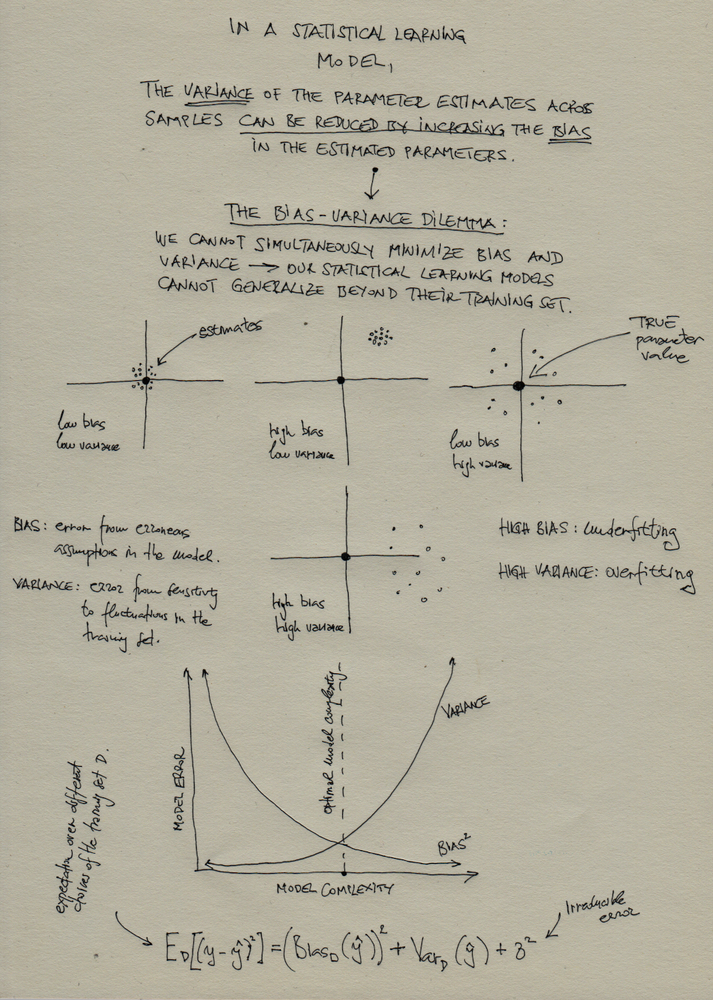

***
# Session 22. Regularization (L1 and L2) in regression problems. Running R code in parallel for efficient data processing and modeling.

**Feedback** should be send to `goran.milovanovic@datakolektiv.com`. 
These notebooks accompany the Intro to Data Science: Non-Technical Background course 2020/21.

***

### What do we want to do today?

In this session we will introduce an additional, important method to control for overfitting in regression models: **regularization**. Both *L1 (Lasso Regression)* and *L2 (Ridge Regression)* norms will be discussed and [{glmnet}](https://cran.r-project.org/web/packages/glmnet/index.html) R package will be used to fit regularized linear models. This session wraps-up our journey in the field of statistical machine learning in the scope of this course. In the second part of the session we will learn how to run R code in parallel w. [{snowfall}](https://cran.r-project.org/web/packages/snowfall/index.html). Then we dive into the first out of three case studies and begin a synthesis of everything that we have learned thus far. 


### 0. Setup

```{r echo = T, eval = F}
install.packages('glmnet')
install.packages('snowfall')
```

Grab the `HR_comma_sep.csv` dataset from the [Kaggle](https://www.kaggle.com/liujiaqi/hr-comma-sepcsv) and place it in your `_data` directory for this session. We will also use the [Boston Housing Dataset:  BostonHousing.csv](https://raw.githubusercontent.com/selva86/datasets/master/BostonHousing.csv)

```{r echo = T, message = F, warning = F}
dataDir <- paste0(getwd(), "/_data/")
library(tidyverse)
library(data.table)
library(glmnet)
```

### 1. Regularization in Linear Regression 

#### 1.1 Lasso (L1), Ridge (L2), and Elastic Net regression

Regularization is used for several purposes: 

- it helps reduce the problem of multicollinearity in Linear Regression,
- it is used as method of **feature selection** in large models, and 
- it is used as a method to prevent overfitting.

Consider the following:

$$Loss = \sum_{i=1}^{n}{\big(y_i-\hat{y_i}\big)^2}$$

It is just the ordinary sum of squares, or the **loss** (or **cost**) function of the Linear Regression Model. The parameters $\beta$ of the Linear Model are estimate by minimizing the above quantity - the model's *cost function*.

Now, consider the following formulation of the cost function that includes the *penalty term*:

$$Loss_{L2} = \sum_{i=1}^{n}{\big(y_i-\hat{y_i}\big)^2}+\lambda\sum_{j=1}^{p}\beta_j^2$$

$\lambda\sum_{j=1}^{p}\beta_j^2$ is the *penalty term*: it increases the value of the cost function by a factor determined by the sum of the squared model coefficients. In the expression above $p$ stands for the number of model parameters (coefficients, in the case of Linear Regression) and $\beta$ are the coefficients themselves. The above expression represents the $L2$ regularization for the Linear Model, also known as **Ridge Regression**. If $\lambda$ is zero we get back to the Ordinary Least Squares model that we have already learned about. If $\lambda$ is too large, it will add too much weight to the cost function which will lead to *underfitting*. 
The underlying idea is to *penalize* large coefficients: it *regularizes* the coefficients so that if they take large values the cost function is penalized. In effect, the Ridge regression shrinks the coefficients so to reduce the model complexity and reduces the effects multicollinearity.

Consider now the following modification of the cost function:

$$Loss_{L1} = \sum_{i=1}^{n}{\big(y_i-\hat{y_i}\big)^2}+\lambda\sum_{j=1}^{p}|\beta_j|$$

The above cost function is based on a weighted sum of the *absolute* values of the model coefficients. This approach is known as $L1$ or **Lasso Regression**. 

The most important **difference between Ridge and Lasso regularization** is that in Lasso some coefficients can be *shrinked to zero* and get completely eliminated from the model. Thus, Lasso regularization does not only prevent overfitting but also performs **feature selection** - a very handy thing when considering large linear models. 

Finally, consider the following formulation of a loss (or cost) function:

$$Loss_{ElasticNet} = \frac{\sum_{i=1}^{n}(y_i-\hat{y_i})^2}{2n}+\lambda(\frac{1-\alpha}{2}\sum_{j=1}^{m}\hat{\beta_j}^2+\alpha\sum_{j=1}^{m}|\hat{\beta_j}|)$$

In the expression above - the **Elastic Net** regression - $\alpha$ is the *mixing parameter* between Lasso ($\alpha=1$) and Ridge ($\alpha=0$) approach. While the Ridge regression shrinks the coefficients of correlated predictors towards each other, the Lasso regression tends to pick one of them and decrease the others. The Elastic Net penalty is a mixture of the two approaches controled by $\alpha$.


#### 1.2 Regularized Linear Regression in R w. {glmnet}

We will use {glmnet} to fit regularized linear regression models in R. We begin with Lasso in the Boston Housing dataset:


```{r echo = T, message = F, warning = F}
library(glmnet)
dataSet <- read.csv(paste0('_data/', 'BostonHousing.csv'), 
                    header = T, 
                    check.names = F,
                    stringsAsFactors = F)
head(dataSet)
```

Here goes the $L1$ (Lasso) regularization in a Linear Model:

```{r echo = T, message = F, warning = F}
predictors <- dataSet %>% 
  dplyr::select(-medv)
l1_Model <- glmnet(as.matrix(predictors),
                   y = dataSet$medv)
```

Pay attention that the formulation of the Linear Model is somewhat different in {glmnet} in comparison to what we have learned thus far on the usage of the R formula interface (in `lm()`, for example): we need to split the `predictors` from the the outcome which is passed in the `y` argument as in the above chunk. The `glmnet` function really solves the Elastic Net regression using $\alpha=1$ as its default: the Lasso (L1) regression.

`glmnet()` returns a set of models for us:

```{r echo = T, message = F, warning = F}
dim(as.matrix(l1_Model$beta))
```

```{r echo = T, message = F, warning = F}
as.matrix(l1_Model$beta)
```

There are as many models estimated as there were different values of $\lambda$ - the parameter that controls the penalization - that were tried out.

```{r echo = T, message = F, warning = F}
length(l1_Model$lambda)
```

The values of lambda tried out in $L1$ Lasso regularization were:

```{r echo = T, message = F, warning = F}
l1_Model$lambda
```

Because the estimation in {glmnet} is done over a penalized likelihood function, the optimal model is the one with the minimal deviance (as in GLMs):

```{r echo = T, message = F, warning = F}
which.min(deviance(l1_Model))
```

```{r echo = T, message = F, warning = F}
l1_Model$lambda[76]
```
In {glmnet}, cross-validation across $\lambda$ can be performed by `cv.glmnet()`:

```{r echo = T, message = F, warning = F}
cv_l1Model <- cv.glmnet(x = as.matrix(predictors),
                        y = dataSet$medv,
                        nfolds = 10)
plot(cv_l1Model)
```

```{r echo = T, message = F, warning = F}
cv_l1Model$lambda
```
The mean cross-validated error across the tried out values of $\lambda$ is:

```{r echo = T, message = F, warning = F}
cv_l1Model$cvm
```
And the respective value of $\lambda$ is:

```{r echo = T, message = F, warning = F}
cv_l1Model$lambda.min
```
So the optimal Lasso model would be:

```{r echo = T, message = F, warning = F}
l1Optim_Model <- glmnet(predictors,
                        y = dataSet$medv, 
                        lambda = cv_l1Model$lambda.min)
predicted_medv <- predict(l1Optim_Model,
                          newx = as.matrix(predictors))
predictFrame <- data.frame(predicted_medv = predicted_medv, 
                           observed_medv = dataSet$medv)
ggplot(data = predictFrame, 
       aes(x = predicted_medv,
           y = observed_medv)) + 
  geom_smooth(method = "lm", size = .25, color = "red") + 
  geom_point(size = 1.5, color = "black") + 
  geom_point(size = .75, color = "white") +
  ggtitle("LASSO: Observed vs Predicted\nBoston Housing Dataset") + 
  theme_bw() + 
  theme(panel.border = element_blank()) +
  theme(plot.title = element_text(hjust = .5, size = 8))

```

The $L2$ or Ridge regression is obtained from {glmnet} by setting `alpha` to zero:

```{r echo = T, message = F, warning = F}
predictors <- dataSet %>% 
  dplyr::select(-medv)
l2_Model <- glmnet(predictors,
                   y = dataSet$medv, 
                   alpha = 0)
l2_Model$lambda
```

Remember: The `alpha` parameter (has a default value of `1`) is the *Elastic Net mixing parameter*: the mixing parameter between Ridge ($\alpha=0$) and Lasso ($\alpha=1$).

The {glmnet} package will perform an automatic cross-validation across $\lambda$, as demonstrated, but you will need to develop your own cross-validation for the mixing parameter $\alpha$.

### 3. The Bias-Variance Tradeoff



### 2. Run R code in parallel w. {snowfall}

Let's clean up our environment first, set the `dataDir` again, and import the {snowfall} library:

```{r echo = T, message = F, warning = F}
rm(list = ls())
dataDir <- paste0(getwd(), "/_data/")
library(snowfall)
library(randomForest)
```

We choose to parallelize R code with {snowfall} because it presents arguably the simplest interface for parallel computation R.

We are getting back to the `HR_comma_sep.csv` dataset and the Random Forest model:

```{r echo = T, message = F, warning = F}
dataSet <- read.csv(paste0(getwd(), "/_data/HR_comma_sep.csv"),
                    header = T,
                    check.names = 1,
                    stringsAsFactors = F)
glimpse(dataSet)
```

We will immediately add the `ix` column to the dataset to prepare it for a 5-fold cross-validation:

```{r echo = T, message = F, warning = F}
dataSet$ix <- sample(1:5, dim(dataSet)[1], replace = T)
table(dataSet$ix)
```

Recall that in our previous Session 21 it took approximately 17 minutes to cross-validate a set of Random Forest models for this dataset with the following ranges of parameters `ntree` and `mtry` in a 5-fold CV:

```{r echo = T, message = F, warning = F}
ntree <- seq(250, 1000, by = 250)
mtry <- 1:(dim(dataSet)[2]-2)
folds <- 1:5
```

Now we want to make the CV procedure way more efficient by growing many Random Forest models in parallel. This is how we approach the problem in a typical {snowfall} workflow:

```{r echo = T, message = F, warning = F}
cv_design <- expand.grid(ntree, mtry, folds)
colnames(cv_design) <- c('ntree', 'mtry', 'fold')
head(cv_design)
```

The `expand.grid()` function is used to combine several factors in order of fast they change in a design matrix. This time it helped us planned our CV procedure by efficiently combining all levels of `ntree`, `mtry`, and `fold`. Each of the 180 rows in the `cv_design` data.frame describes exactly one Random Forest model that we need to grow, each model described by a particular value of `ntree`, `mtry` and the `fold` that will be used as a test dataset. Now we want to *turn `cv_design` into a list*:

```{r echo = T, message = F, warning = F}
cv_design <- apply(cv_design, 1, function(x) {
  list(ntree = x[1],
       mtry = x[2],
       fold = x[3])
})
```

Now we can do things such as:

```{r echo = T, message = F, warning = F}
cv_design[[1]]
```

and: 

```{r echo = T, message = F, warning = F}
cv_design[[1]]$ntree
```

In {snowfall}, we use a special family of parallelized `*apply()` functions. But before we demonstrate that, we need a bit of a preparation. We will now turn your computer into a cluster (!). All modern CPUs have mulitple threads that can be used as separate logical units for computation. In this approach, we will make each thread available on your system work on a separate Random Forest model in parallel, thus speeding up the CV procedure.

The package `{parallel}` is present by default in your R installation. Call `parallel::detectCores()` to detect the number of threads that you can use:

```{r echo = T, message = F, warning = F}
parallel::detectCores()
```
Pronounce `parallel::detectCores() - 1` to be a numeric `numCores`:

```{r echo = T, message = F, warning = F}
numCores <- parallel::detectCores() - 1
numCores
```
Now we need to initialize a cluster with `numCores` workers:

```{r echo = T, message = F, warning = F}
sfInit(parallel = TRUE, cpus = numCores)
```

Next, we need to export the data *and the functions* that we will use to the cluster:

```{r echo = T, message = F, warning = F}
sfExport('dataSet')
sfLibrary(dplyr)
sfLibrary(randomForest)
```

Finally, we need to code our CV procedure to run in parallel. Here is how we can do that:

```{r echo = T, message = F, warning = F}
tstart <- Sys.time()
rfModels <- sfClusterApplyLB(cv_design, function(x) {
  # - pick up parameters from x
  ntree <- x$ntree
  mtry <- x$mtry
  fold <- x$fold
  # - split training and test sets
  testIx <- fold
  trainIx <- setdiff(1:5, testIx)
  trainSet <- dataSet %>%
    dplyr::filter(ix %in% trainIx) %>%
    dplyr::select(-ix)
  testSet <- dataSet %>%
    dplyr::filter(ix %in% testIx) %>%
    dplyr::select(-ix)
  # - `left` to factor for classification w. randomForest()
  trainSet$left <- as.factor(trainSet$left)
  testSet$left <- as.factor(testSet$left)
  # - Random Forest:
  model <- randomForest::randomForest(formula = left ~ .,
                                      data = trainSet,
                                      ntree = ntree,
                                      mtry = mtry
                                      )
  # - ROC analysis:
  predictions <- predict(model,
                         newdata = testSet)
  hit <- sum(ifelse(predictions == 1 & testSet$left == 1, 1, 0))
  hit <- hit/sum(testSet$left == 1)
  fa <- sum(ifelse(predictions == 1 & testSet$left == 0, 1, 0))
  fa <- fa/sum(testSet$left == 0)
  acc <- sum(predictions == testSet$left)
  acc <- acc/length(testSet$left)
  # - Output:
  return(
    data.frame(ntree = ntree, 
               mtry = mtry,
               fold = fold,
               hit = hit,
               fa = fa,
               acc = acc)
  )
})
# - collect all results
rfModels <- rbindlist(rfModels)
write.csv(rfModels, 
          paste0(getwd(), "/rfModels.csv"))
# - Report timing:
print(paste0("The estimation took: ", 
             difftime(Sys.time(), tstart, units = "mins"), 
             " minutes."))
```

**Do not forget to shutdown the cluster:**

```{r echo = T, message = F, warning = F}
sfStop()
```

And here are the average results across the values of `ntree` and `mtry`:

```{r echo = T, message = F, warning = F}
rfModels <- rfModels %>% 
  group_by(ntree, mtry) %>% 
  summarise(hit = mean(hit), 
            fa = mean(fa), 
            acc = mean(acc))
rfModels
```
```{r echo = T, message = F, warning = F}
rfModels$ntree <- factor(rfModels$ntree)
rfModels$mtry <- factor(rfModels$mtry)
ggplot(data = rfModels, 
       aes(x = mtry,
           y = acc, 
           group = ntree, 
           color = ntree,
           fill = ntree,
           label = round(acc, 2))
       ) +
  geom_path(size = .25) + 
  geom_point(size = 1.5) + 
  ggtitle("Random Forests CV: Accuracy") +
  theme_bw() + 
  theme(panel.border = element_blank()) +
  theme(plot.title = element_text(hjust = .5, size = 8))
```

```{r echo = T, message = F, warning = F}
ggplot(data = rfModels, 
       aes(x = mtry,
           y = hit, 
           group = ntree, 
           color = ntree,
           fill = ntree,
           label = round(acc, 2))
       ) +
  geom_path(size = .25) + 
  geom_point(size = 1.5) + 
  ggtitle("Random Forests CV: Hit Rate") +
  theme_bw() + 
  theme(panel.border = element_blank()) +
  theme(plot.title = element_text(hjust = .5, size = 8))
```

```{r echo = T, message = F, warning = F}
ggplot(data = rfModels, 
       aes(x = mtry,
           y = fa, 
           group = ntree, 
           color = ntree,
           fill = ntree,
           label = round(acc, 2))
       ) +
  geom_path(size = .25) + 
  geom_point(size = 1.5) + 
  ggtitle("Random Forests CV: FA Rate") +
  theme_bw() + 
  theme(panel.border = element_blank()) +
  theme(plot.title = element_text(hjust = .5, size = 8))
```


***

### Further Readings

+ [L1 and L2 Regularization Methods, Anuja Nagpal, Towards Data Science](https://towardsdatascience.com/l1-and-l2-regularization-methods-ce25e7fc831c)

+ [L2 and L1 Regularization in Machine Learning, Neelam Tyagi, analyticsteps](https://www.analyticssteps.com/blogs/l2-and-l1-regularization-machine-learning)

+ [An Introduction to glmnet, Trevor Hastie, Junyang Qian, Kenneth Tay, February 22, 2021](https://glmnet.stanford.edu/articles/glmnet.html)

+ [Bias–variance tradeoff, English Wikipedia](https://en.wikipedia.org/wiki/Bias%E2%80%93variance_tradeoff)

+ [Developing parallel programs using snowfall, Jochen Knaus, 2010-03-04](https://cran.r-project.org/web/packages/snowfall/vignettes/snowfall.pdf)


***
Goran S. Milovanović

DataKolektiv, 2020/21

contact: goran.milovanovic@datakolektiv.com


***
License: [GPLv3](http://www.gnu.org/licenses/gpl-3.0.txt)
This Notebook is free software: you can redistribute it and/or modify it under the terms of the GNU General Public License as published by the Free Software Foundation, either version 3 of the License, or (at your option) any later version.
This Notebook is distributed in the hope that it will be useful, but WITHOUT ANY WARRANTY; without even the implied warranty of MERCHANTABILITY or FITNESS FOR A PARTICULAR PURPOSE.  See the GNU General Public License for more details.
You should have received a copy of the GNU General Public License along with this Notebook. If not, see <http://www.gnu.org/licenses/>.

***

